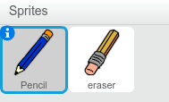

## إنشاء قلم رصاص

لنبدأ بإنشاء قلم رصاص يمكن استخدامه للرسم على المنصة.


+ افتح مشروع 'علبة الألوان' لبرنامج Scratch عبر الإنترنت على at <a href="http://jumpto.cc/paint-go" target="_blank">jumpto.cc/paint-go</a> أو يمكنك تنزيله من <a href="http://jumpto.cc/paint-get" target="_blank">jumpto.cc/paint-get</a> ثم فتحه إذا كنت تستخدم محرِّر الرسم الموجود على الجهاز.

	سترى كائنَي قلم رصاص وممحاة:

		

+ لأنك ستستخدم الماوس للرسم، ستحتاج إلى برمجة القلم الرصاص ليتبع الماوس في حلقة `كرِّر باستمرار`{:class="blockcontrol"}. أضف هذه التعليمة البرمجية إلى كائن القلم الرصاص:

	```blocks
	  when flag clicked
	  forever
	    go to [mouse pointer v]
  	end
	```

+ اختبر هذه التعليمة البرمجية بالنقر فوق العلم ثم تحريك الماوس في كل مكان على المنصة. 

+ بعد ذلك، لنجعل القلم الرصاص يرسم `إذا`{:class="blockcontrol"} تم النقر فوق الماوس. أضف هذه التعليمة البرمجية إلى كائن القلم الرصاص:

		

+ اختبر التعليمة البرمجية مرة أخرى. وفي هذه المرة، حرِّك القلم الرصاص في كل مكان على المنصة ضاغطًا باستمرار على زر الماوس. هل يمكنك الرسم باستخدام القلم الرصاص؟

	
	


