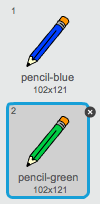

## أقلام ملوَّنة

لنضِف أقلامًا ملوَّنة مختلفة إلى المشروع لنسمح للمستخدم بالاختيار من بينها!


+ انقر فوق كائن القلم الرصاص، ثم انقر فوق 'المظاهر' وضاعف المظهر 'قلم أزرق'.

	

+ غيِّر اسم المظهر الجديد إلى 'قلم أخضر'، ولوِّن القلم الرصاص باللون الأخضر.

	

+ أنشئ كائنَين جديدَين لتستخدمهما في تحديد القلم الأزرق أو الأخضر.

	

+ عند النقر فوق أيقونة محدد اللون الأخضر، ستحتاج إلى `بث`{:class="blockevents"} رسالة إلى القلم الرصاص لتأمره بتغيير مظهره ولون خطه.

	ولتفعل ذلك، أضف هذه التعليمة البرمجية أولًا إلى أيقونة محدد اللون الأخضر:

	```blocks
		when this sprite clicked
		broadcast [green v]
	```

	لإنشاء القالب `بُث`{:class="blockevents"}، انقر فوق سهم القائمة المنسدلة ثم حدِّد 'رسالة جديدة...'.

	

	يمكنك عندئذٍ كتابة 'أخضر' لإنشاء الرسالة الجديدة.

	

+ تحتاج الآن إلى أن تأمر كائن القلم الرصاص بما يجب أن يفعله عندما يتلقى الرسالة. أضف هذه التعليمة البرمجية إلى كائن القلم الرصاص:

  ```blocks
		when I receive [green v]
		switch costume to [pencil-green v]
		set pen color to [#00ff00]
  ```

	لتعيين لون خط القلم إلى اللون الأخضر، انقر فوق الخانة الملوَّنة في القالب `عيِّن لون القلم`{:class="blockpen"}، ثم انقر فوق أيقونة محدد اللون الأخضر لاختيار اللون الأخضر كلَون لخط القلم.

+ يمكنك الآن أن تفعل الشيء نفسه مع أيقونة القلم الأزرق، بإضافة هذه التعليمة البرمجية إلى كائن محدد اللون الأزرق:

  ```blocks
		when this sprite clicked
		broadcast [blue v]
  ```

	...ثم إضافة هذه التعليمة البرمجية إلى كائن القلم الرصاص:

  ```blocks
		when I receive [blue v]
		switch costume to [pencil-blue v]
		set pen color to [#0000ff]
  ```
+ وأخيرًا، تحتاج إلى أن تأمر كائن القلم الرصاص باختيار المظهر ولون القلم المناسبَين، وكذا مسح الشاشة، عند بدء المشروع. أضف هذه التعليمة البرمجية إلى بداية التعليمة البرمجية `عند النقر فوق العلم`{:class="blockevents"} الخاصة بالقلم الرصاص (قبل حلقة `كرِّر باستمرار`{:class="blockcontrol"}):

  ```blocks
		clear
		switch costume to [blue-pencil v]
		set pen color to [#0000ff]
  ```

	يمكنك البدء بقلم لون مختلف إذا أردتَ!

+ اختبر مشروعك. هل يمكنك التحويل بين القلمين الأزرق والأخضر؟

	


