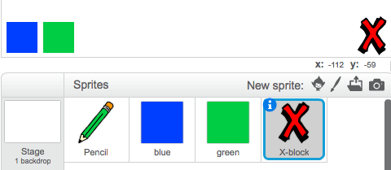

## أخطاء الرسم

لأنه أحيانًا ما تحدث أخطاء أثناء الرسم، سنضيف زر 'مسح' وممحاة إلى المشروع!


+ لنضِف زرًا لمسح المنصة. لتفعل ذلك، أضف كائن الحرف 'X-block' إلى المنصة، ولوِّنه باللون الأحمر.

	

+ أضف تعليمة برمجية إلى زر الإلغاء الجديد لمسح المنصة عند النقر عليه.

	```blocks
		when this sprite clicked
		clear
	```

	لاحظ أنك لا تحتاج إلى إرسال رسالة لمسح المنصة، لأن أي كائن يمكن أن يفعل ذلك!

+ ربما لاحظتَ أن كائن القلم الرصاص يشتمل على مظهر لممحاة:

	
	

+ يحتوي مشروعك أيضًا على كائن محدد الممحاة، انقر عليه بزر الماوس الأيمن واختر 'إظهار'. سيكون شكل المنصة كما يلي:

	

+ يمكنك عندئذٍ إضافة تعليمة برمجية إلى كائن محدد الممحاة لتأمر القلم الرصاص بالتحول إلى ممحاة.

	```blocks
		when this sprite clicked
		broadcast [eraser v]
	```

+ عندما يتلقى القلم هذه الرسالة، يمكنك إنشاء ممحاة بتحويل مظهر القلم إلى ممحاة، وتحويل لون القلم إلى لون المنصة نفسه!

  ```blocks
		when I receive [eraser v]
		switch costume to [eraser v]
		set pen color to [#FFFFFF]
	```

+ اختبر مشروعك لتعرف هل يمكنك مسح المنصة ومحو ما رسمته أم لا.

	

+ توجد مشكلة واحدة أخرى بالنسبة إلى القلم - حيث يمكنك أن ترسم في أي مكان على المنصة حتى بالقرب من الأيقونات المحدِّدة!

	

	لإصلاح هذا الخطأ، يمكنك أن تأمر القلم بألا يرسم إلّا إذا تم النقر فوق الماوس _و_ إذا كانت قيمة موقع y للماوس أكبر من 120- (بحيث تكون عبارة `y الماوس` كما يلي:

	

+ اختبر مشروعك؛ من المفترض الآن أنك لن تستطيع الرسم بالقرب من الأيقونات المحدِّدة.

	


