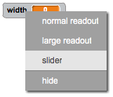

## تغيير عرض خط القلم الرصاص

لنسمح للمستخدم بالرسم باستخدام مجموعة من الأقلام المختلفة في حجم الحجم.


+ أولًا، أضف متغيرًا جديدًا يُسمى 'عرض الخط'. وإذا لم تكن تعرف كيفية القيام بذلك، فيمكنك الرجوع إلى مشروع 'صائدو الأشباح' لمساعدتك.

+ أضف هذا السطر _داخل_ حلقة `كرِّر باستمرار`{:class="blockcontrol"} الخاصة بالتعليمة البرمجية للقلم الرصاص:

	```blocks
		set pen size to (width)
	```

	سيتم الآن تعيين عرض خط القلم بشكل متكرر إلى قيمة المتغير 'عرض الخط'.

+ يمكنك تغيير الرقم الذي يُخزَّن في هذا المتغير بالنقر بزر الماوس الأيمن على المتغير ( الموجود على المنصة) والنقر فوق 'شريط التمرير'.

	

	يمكنك الآن سحب شريط التمرير إلى أسفل المتغير لتغيير قيمته.

	

+ اختبر مشروعك، ولاحظ هل يمكنك تعديل عرض خط القلم أم لا.

	

	يمكنك تعيين الحدَّين الأدنى والأقصى المسموح بهما لقيمة المتغير 'عرض الخط' إذا أردتَ. ولتفعل ذلك، انقر بزر الماوس الأيمن على المتغير مرة أخرى ثم انقر فوق 'تعيين الحدَّين الأدنى والأقصى لشريط التمرير'. عيِّن القيمتَين الدنيا والقصوى للمتغير إلى نطاق أكثر معقولية، من 1 إلى 20 مثلًا.

	

	تابع اختبار المتغير 'عرض الخط' حتى تصل إلى النتيجة التي تريدها.


