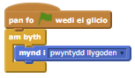
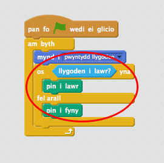

## Creu pensil

Fe wnawn ni ddechrau trwy greu pensil mae modd defnyddio i arlunio ar y llwyfan.

+ Agora'r prosiect Scratch 'Bocs Paentio' arlein yma <a href="http://jumpto.cc/paint-go" target="_blank">jumpto.cc/paint-go</a> neu lawrlwytha o <a href="http://jumpto.cc/paint-get" target="_blank">jumpto.cc/paint-get</a> ac agora'r prosiect yn defnyddio golygydd ar y cyfrifiadur.

	Fe weli di y cipluniau pensil a dileuwr:

		

+ Gan y byddi di'n defnyddio'r llygoden i dynnu llun, fyddi di eisiau i'r pensil ddilyn y llygoden `am byth`{:class="blockcontrol"}.  Ychwanega'r côd yma i'r ciplun pensil:

		

+ Profa'r côd yma trwy glicio ar y faner a symud y llygoden o gwmpas y llwyfan.

+ Nesaf, fe wnawn ni wneud i'r pensil dynnu llun `os`{:class="blockcontrol"} yw'r llygoden wedi ei glicio. Ychwanega'r côd yma i giplun dy bensil:

		

+ Profa dy gôd eto. Tro yma, symuda'r pensil o gwmpas y llwyfan gan gadw dy fys ar fotwm y llygoden. Alli di dynnu llun gyda dy bensil?

	
	

