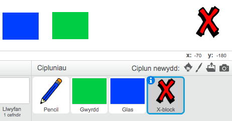
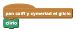
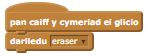
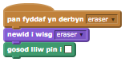
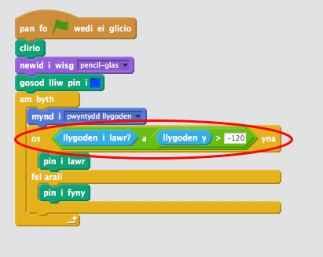

## Gwneud camgymeriadau

Weithiau mae camgymeriadau yn digwydd, felly fe wnawn ni ychwanegu botwm 'clirio' a dileuwr i dy brosiect!

+ Fe wnawn ni ychwanegu botwm i glirio'r llwyfan. I wneud hyn, ychwanega'r ciplun llythyren 'X-block' i'r llwyfan, a lliwia fe'n goch.

	

+ Ychwanega côd i'r botwm dileu i glirio'r llwyfan pan mae'n cael ei glicio.
	
  

	Sylwa nad oes angen i ti anfon neges i glirio'r llwyfan, gan fod unrhyw giplun yn gallu gwneud!

+ Rwyt ti siwr o fod wedi sylwi bod ciplun dy bensil yn cynnwys gwisg dileuwr:

	
	

+ Mae dy brosiect hefyd yn cynnwys ciplun dewisydd dileuwr, gwna clic dde arno a dewis 'dangos'. Dyma sut ddylsai dy lwyfan edrych:

	

+ Mae modd i ti nawr ychwanegu côd i'r ciplun dileuwr, i ddweud wrth y pensil i newid i'r dileuwr.
	
  

+ Pan mae'r pensil yn derbyn y neges yma, alli di greu dileuwr trwy newid gwisg y pensil i fod yn ddileuwr, a newid lliw y pensil i fod yr un lliw â'r llwyfan!

  

+ Profa dy brosiect, i weld os wyt ti'n gallu clirio a dileu y llwyfan.

	

+ Mae yna un problem arall gyda'r pensil - mae modd i ti dynnu llun unrhywle ar y llwyfan, yn cynnwys eicon y dewisydd!

	

	I ddatrys hyn, mae angen i ti ddweud wrth y pensil i dynnu llun os yw'r llygoden wedi clicio _ac_os mae y-position y llygoden yn fwy na -120 (`llygoden y`{:class="blocksensing"}`> -120`{:class="blockoperators"}).
	Newida datganiad `os`{:class="blockcontrol"} y pensil i edrych fel hyn:

	

+ Profa dy brosiect, nawr ni ddyle ti allu tynnu llun yn agos i'r blociau dewis.

	

