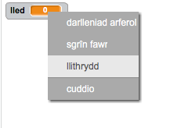
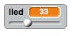
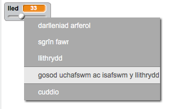

## Newid lled y pensil

Rydym eisiau gadael i'r defnyddiwr i dynnu llun yn defnyddio amrywiaeth o feintiau pensiliau gwahanol. 

+ Yn gyntaf, ychwanega newidyn newydd o'r enw 'lled'.  Os nad wyt ti'n siwr sut i wneud hyn, bydd y prosiect 'Ghostbusters' yn gymorth.

+ Ychwanega'r llinell yma _tu fewn_ y ddolen `am byth`{:class="blockcontrol"} yn nghôd y pensil:

	

	Bydd lled dy bensil nawr yn cael ei osod i gyfanswm 'lled' y newidyn.

+ Mae modd i ti newid y rhif sydd yn cael ei storio yn y newidyn yma trwy wneud clic-dde ar y newidyn (ar y llwyfan) a chlicio 'llithrydd'.

	

	Galli di nawr lusgo'r llithrydd o dan y newidyn i newid ei werth.

	

+ Profa dy brosiect, a gweld os alli di amrywio lled y pensil.

	

	Os oes well gyda ti, galli di osod gwerth isafswm ac uchafswm y 'lled'.  I wneud hyn, gwna clic-dde ar y newidyn eto a clicia 'set slider min and max'.  Gosoda'r lleiafswm ac uchafswm y newidyn i rhywbeth mwy call, fel 1 a 20.

	

	Profa dy newidyn 'lled' tan dy fod di'n hapus.

