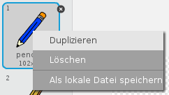
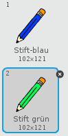
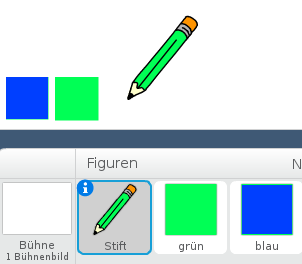
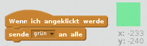
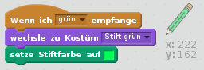
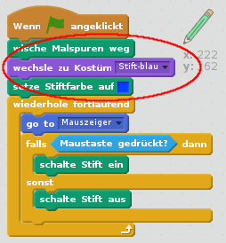

## Buntstifte

Laß uns deinem Projekt verschiedene Buntstifte hinzufügen, die der Anwender dann auswählen kann.

+ Klicke auf deine Stift-Figur, dann auf Kostüme und dupliziere dein 'blaues Stift-Kostüm'.



+ Benenne dein neues Kostüm um zu "Stift grün" und das alte zu "Stift-blau".



[[[generic-scratch-rename-sprite]]]

+ Zeichne zwei neue Figuren - ein blaues und ein grünes Quadrat. Diese verwendest du um die Stiftfarbe umzuschalten.



+ Benenne die neuen Figuren 'blau' und 'grün'

+ Füge nun Code zur 'grün'-Figur hinzu so dass sie, wenn sie geklickt wird, die Nachricht "grün" `an alle schickt`{:class="blockevents"}. Dadurch sagst du dem Stift dass er sein Kostüm und seine Farbe ändern soll.



[[[generic-scratch-broadcast-message]]]

+ Schalte zu deiner Stift-Figur. Füge Code hinzu, so dass diese Figur, wenn sie die Nachricht "grün" `an alle`{:class="blockevents"} empfängt, zum grünen Stift-Kostüm wechselt und die Stiftfarbe zu grün ändert.



Um die Zeichenfarbe auf das gleiche Grün wie das Auswahlfeld zu setzen, klicke das farbige Kästchen in `setze Stiftfarbe auf`{:class="blockpen"} und klicke dann auf das grüne Quadrat.

+ Nun kannst du das gleiche für das blaue Symbol machen: füge diesen Code zum blauen Quadrat hinzu:

```blocks
Wenn ich angeklickt werde
sende [blau v] an alle
```

...und diesen Code zur Stift-Figur hinzu:

```blocks
Wenn ich [blau v] empfange
wechsle zu Kostüm [Stift-blau v]
setze Stiftfarbe auf [#0000ff]
```

+ Zum Schluß fügst du noch Code ein, um die Bühne zu löschen und um festzulegen mit welcher Farbe du beginnst.



Wir haben hier blau gewählt, aber du kannst mit einer anderen Stiftfarbe beginnen, wenn du es lieber hast.

+ Teste nun dein Projekt. Kannst du zwischen den blauen und grünen Stiften umschalten, indem du das blaue bzw. grüne Quadrat anklickst?

