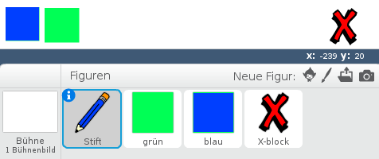
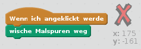
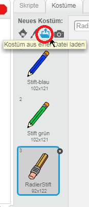
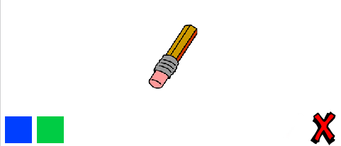
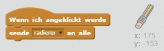
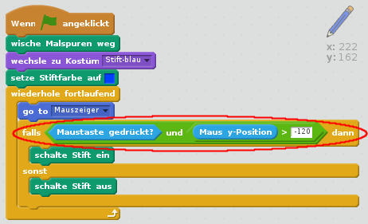

## Fehler machen

Manchmal passieren Fehler, lass uns also einen 'Löschen'-Knopf und einen Radiergummi hinzufügen.

+ Füge die 'X-block'-Figur hinzu - du findest sie in der Bibliothek, in der Kategorie Buchstaben. Färbe das Kostüm rot. Das wird der 'Löschen'-Knopf.



+ Füge Code zu dieser Figur hinzu, um die Bühne zu löschen, wenn sie geklickt wird.



Beachte, dass du gar keine Nachricht senden musst um die Bühne zu löschen, es genügt der Block "wische Malspuren weg" der Figur.

Du hast vielleicht schon bemerkt, dass die Stift-Figur auch ein Radier-Kostüm enthält:



+ Dein Projekt enthält auch eine eigene Radier-Figur. Klicke rechts auf diese Figur und wähle 'zeige dich'. Du kannst die Figur auch zu 'Radierer' umbenennen. So sollte deine Bühne jetzt aussehen:



+ Füge der Radierer-Figur Code hinzu, um den Stift auf radieren umzuschalten.



Wenn der Stift die "radieren"-Nachricht erhält, musst du das Stift-Kostüm zu "Radier-Stift" ändern und die Stiftfarbe auf weiß ändern - die Farbe der Bühne!

+ Füge Code hinzu um den Radierer zu schaffen

--- hints --- --- hint --- Füge der Stift-Figur folgenden Code hinzu: **Wenn Ich** die Nachricht **radieren** empfange **wechsle zu Kostüm** RadierStift **Setze Stiftfarbe auf** weiß --- /hint --- --- hint --- So sollte der Code der Stift-Figur aussehen:

```blocks
Wenn ich [radieren v] empfange
wechsle zu Kostüm [RadierStift v]
setze Stiftfarbe auf [#FFFFFF]
```

--- /hint --- --- /hints ---

+ Teste dein Projekt und schau, ob du radieren kannst und die Bühne löschen kannst.


Es gibt noch ein Problem mit dem Stift - du kannst auf der ganzen Bühne zeichnen, auch im Bereich der Auswahlsymbole!


Um das zu beheben, sag dem Stift, er darf nur dann zeichnen, wenn die Maustaste gedrückt ist *und* wenn die y-Position größer als -120 ist:



+ Teste dein Projekt; du solltest jetzt nicht mehr in der Nähe der Auswahlsymbole zeichnen können.

