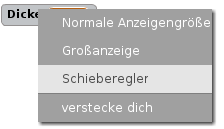
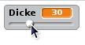
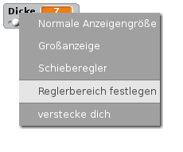

## Die Stiftdicke ändern

Geben wir dem Anwender die Möglichkeit verschieden dicke Stifte zu benutzen.

+ Füge zuerst eine neue Variable namens `Dicke`{:class="blockvariable"} hinzu.

[[[generic-scratch-add-variable]]]

+ Füge diese Zeile *innerhalb* der `wiederhole fortlaufend`{:class="blockcontrol"} Schleife vom Stift ein:

```blocks
    setze Stiftdicke auf (Dicke)
```

Die Stift-Dicke wird nun immer wieder auf den Wert der 'Dicke'-Variablen gesetzt.

+ Klicke mit der rechten Maustaste auf die Variablen-Anzeige auf der Bühne und klicke auf 'Schieberegler'.



Jetzt kannst du den Schieberegler unter der Variablen ziehen, um den Wert zu verändern.



+ Teste dein Projekt und sieh, ob du die Stift-Dicke verändern kannst.


Wenn du möchtest, kannst du die erlaubten Mindest- und Maximal-Werte für 'Dicke' festlegen. Dazu klickst du nochmals mit der rechten Maustaste auf die Variable und klickst auf 'Reglerbereich festlegen'. Setze die Mindest- und Maximal-Werte auf etwas passenderes, wie 1 und 20.



Teste deine Dicken-Variable bis du zufrieden bist.
