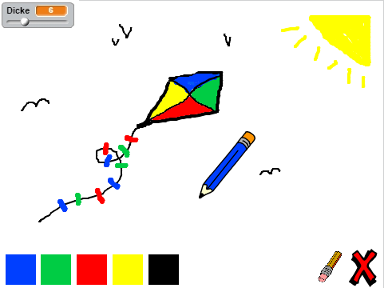

--- challenge ---

## Zusatzaufgabe: mehr Stifte

Kannst du rote, gelbe und schwarze Stifte zu deinem Mal-Programm hinzufügen? Sieh nochmals bei Schritt 2 nach, wenn du vergessen hast, wie das geht. Vergiss nicht, für diese neuen Farbstifte ebenfalls Tastenkürzel anzulegen.

Kannst du mit deinen Stiften ein Bild malen?

--- /challenge ---
***
### Von der Community übersetzt 

Dieses Projekt wurde von **Karl Schuh** übersetzt und von **Helmut Schlimper** überprüft.

Unsere großartigen Freiwilligen helfen uns, Kindern auf der ganzen Welt die Möglichkeit zu geben, coden zu lernen. Sie können uns helfen, mehr Kinder zu erreichen, indem Sie unsere Projekte übersetzen - lesen Sie mehr unter [rpf.io/translators](https://rpf.io/translators).
