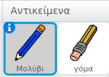
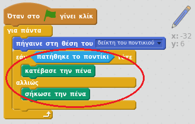
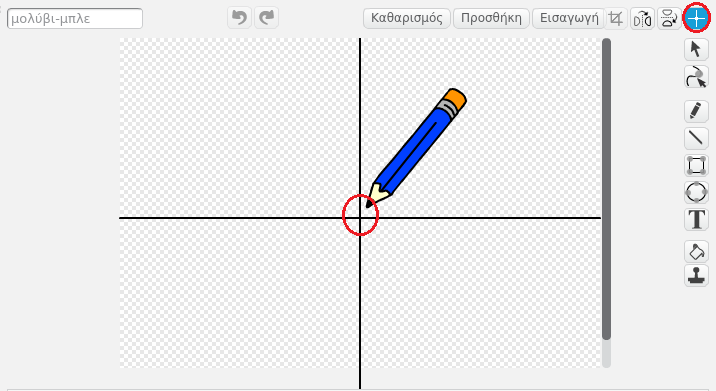

## Κάνοντας ένα μολύβι

Ας αρχίσουμε κάνοντας ένα μολύβι που μπορεί να χρησιμοποιηθεί για να σχεδιάσεις στο σκηνικό.

+ Άνοιξε το έργο Scratch 'Paintbox' online στο [jumpto.cc/paint-go-el-GR](https://scratch.mit.edu/projects/227796505/#editor){:target="_blank"} ή κάνε λήψη από το [http://jumpto.cc/paint-get-el-GR](https://github.com/raspberrypilearning/paint-box-scratch2/raw/master/el-GR/resources/PaintBox.sb2) και στη συνέχεια άνοιξε το, αν χρησιμοποιείς την offline εφαρμογή Scratch.

Θα δεις αντικείμενα μολυβιού και γόμας:



+ Πρόσθεσε κώδικα στο μολύβι για να το κάνεις να ακολουθεί το ποντίκι `για πάντα`{:class="blockcontrol"}, ώστε να μπορείς να σχεδιάσεις:

```blocks
    Όταν στην πράσινη σημαία γίνει κλικ
    για πάντα 
    πήγαινε στη θέση του [δείκτης ποντικιού v]
    τέλος
```

+ Κάνε κλικ στη σημαία και στη συνέχεια, μετακίνησε το ποντίκι στο σκηνικό για να ελέγξεις ότι ο κώδικας λειτουργεί.

Έπειτα, ας κάνουμε το μολύβι σου να σχεδιάζει μόνο `εάν`{:class="blockcontrol"} το ποντίκι έχει πατηθεί.

+ Πρόσθεσε αυτόν τον κώδικα στο αντικείμενο μολύβι:



+ Δοκίμασε ξανά τον κώδικά σου. Αυτή τη φορά, μετακίνησε το μολύβι στο σκηνικό κρατώντας πατημένο το αριστερό κουμπί του ποντικιού. Μπορείς να σχεδιάσεις με το μολύβι σου;


--- collapse ---
---
title: Αν έχεις προβλήματα...
---
Εάν το μολύβι σου φαίνεται να τραβάει τη γραμμή από τη μέση του μολυβιού αντί της μύτης, θα χρειαστεί να αλλάξεις το κέντρο της ενδυμασίας.



Ο σταυρός για το μολύβι πρέπει να τοποθετηθεί **ακριβώς κάτω από το** τη μύτη και όχι πάνω στην μύτη του μολυβιού.

Οι αλλαγές στο 'κέντρο ενδυμασίας' ενός αντικειμένου δεν έχουν καταχωριστεί μέχρι να γίνει κλικ σε άλλη καρτέλα, οπότε κάνε κλικ σε μια άλλη ενδυμασία ή στην καρτέλα 'Σενάρια' για να ολοκληρώσεις τις αλλαγές στο κέντρο ενδυμασίας.

--- /collapse ---
