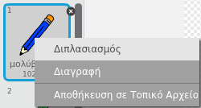
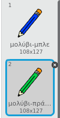
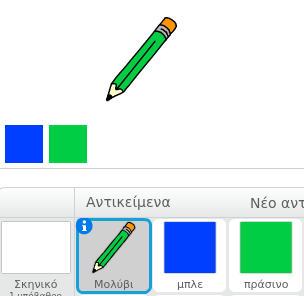
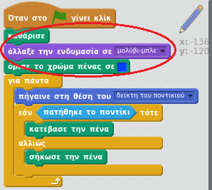

## Χρωματιστά μολύβια

Ας προσθέσουμε διαφορετικά χρωματιστά μολύβια στο έργο σου, επιτρέποντας στο χρήστη να επιλέγει μεταξύ αυτών.

+ Κάνε κλικ στο μολύβι σου, κλικ στο 'Ενδυμασίες' και διπλασίασε την ενδυμασία 'μολύβι-μπλε'.



+ Μετονόμασε τη νέα ενδυμασία σε «μολύβι-πράσινο» και χρωμάτισε το μολύβι πράσινο.



[[[generic-scratch-rename-sprite]]]

+ Σχεδίασε δύο νέα αντικείμενα - ένα μπλε τετράγωνο και ένα πράσινο τετράγωνο. Θα τα χρησιμοποιείς για να επιλέγεις το μπλε ή πράσινο μολύβι.



+ Μετονόμασε τα αντικείμενά σου έτσι ώστε να ονομάζονται 'μπλε' και 'πράσινο'

+ Πρόσθεσε κώδικα στο 'πράσινο' αντικείμενο, έτσι ώστε όταν πατηθεί, να `μεταδίδει`{:class="blockevents"} το μήνυμα "πράσινο" στο αντικείμενο μολύβι, λέγοντάς του να αλλάξει ενδυμασία και χρώμα.


[[[generic-scratch-broadcast-message]]]

+ Επέλεξε το αντικείμενο μολύβι. Πρόσθεσε κώδικα έτσι ώστε όταν λάβει την `μετάδοση`{:class="blockevents"} πράσινο, να αλλάζει στην πράσινη ενδυμασία του και να αλλάζει το χρώμα του σε πράσινο.


Για να ρυθμίσεις το χρώμα του μολυβιού σε πράσινο, κάνε κλικ στο έγχρωμο πλαίσιο στο μπλοκ `όρισε το χρώμα πένας σε`{:class="blockpen"} και στη συνέχεια κάνε κλικ στο πράσινο αντικείμενο για να επιλέξεις το ίδιο πράσινο χρώμα με αυτό του μολυβιού σου.

+ Τώρα μπορείς να κάνεις το ίδιο και για το μπλε μολύβι: πρόσθεσε αυτόν τον κώδικα στο μπλε τετράγωνο αντικείμενο:

```blocks
όταν σε αυτό το αντικείμενο γίνει κλικ
 μετάδωσε [μπλε v]
```

... και πρόσθεσε αυτόν τον κώδικα στο μολύβι:

```blocks
Όταν λάβω το [μπλε v]
άλλαξε την ενδυμασία σε [μολύβι-μπλε v]
όρισε το χρώμα πένας σε [#0000ff]
```

+ Τέλος, πρόσθεσε αυτόν τον κώδικα για να πεις στο αντικείμενο μολύβι με ποιο χρώμα πρέπει να ξεκινά και βεβαιώσου ότι το σκηνικό είναι καθαρό.



Επιλέξαμε να ξεκινήσεις με μπλε χρώμα, αλλά αν προτιμάς, μπορείς να ξεκινήσεις με ένα διαφορετικό χρώμα μολυβιού.

+ Δοκίμασε το έργο σου. Μπορείς να αλλάζεις ανάμεσα σε μπλε και πράσινο μολύβι κάνοντας κλικ στο μπλε ή πράσινο τετράγωνο αντικείμενο;


