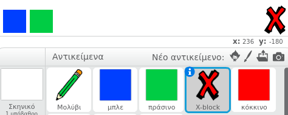
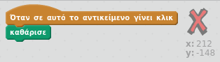
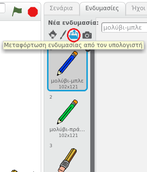
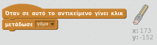
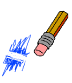
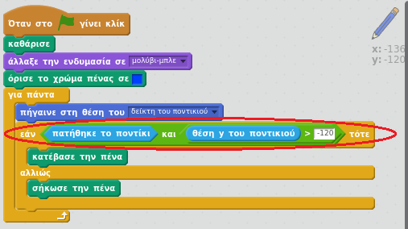

## Κάνοντας λάθη

Μερικές φορές συμβαίνουν λάθη, οπότε πρόσθεσε ένα κουμπί "καθαρισμός" και μια γόμα.

+ Πρόσθεσε το αντικείμενο "X-block" - θα το βρεις στη βιβλιοθήκη, στην ενότητα Γράμματα. Χρωμάτισε την ενδυμασία με κόκκινο. Αυτό θα είναι το κουμπί "Καθαρισμός".



+ Πρόσθεσε κώδικα σε αυτό το αντικείμενο για να καθαρίζεις το σκηνικό όταν πατηθεί.



Παρατήρησε ότι δεν χρειάζεται να στείλεις ένα μήνυμα για να καθαρίσεις το σκηνικό. Μπορείς απλά να χρησιμοποιήσεις το μπλοκ καθαρισμού από αυτό το αντικείμενο.

Ίσως έχεις παρατηρήσει ότι το μολύβι σου περιλαμβάνει μία ενδυμασία γόμας:



+ Το έργο σου περιλαμβάνει επίσης ένα ξεχωριστό αντικείμενο γόμας. Κάνε δεξί κλικ σε αυτό το αντικείμενο και επέλεξε 'εμφανίσου'. Έτσι πρέπει να φαίνεται το σκηνικό σου:


+ Πρόσθεσε κώδικα στο αντικείμενο γόμας, για να πεις στο μολύβι να αλλάζει σε γόμα όταν αυτό πατηθεί.



Όταν το μολύβι λάβει το μήνυμα "γόμα", μπορείς να αλλάξεις την ενδυμασία του μολυβιού στη γόμα και να αλλάξεις το χρώμα του μολυβιού σε λευκό - το ίδιο χρώμα με το σκηνικό!

+ Πρόσθεσε κώδικα για να δημιουργήσεις τη γόμα

--- hints --- --- hint --- Πρόσθεσε κώδικα στο μολύβι: **Όταν λάβω** το μήνυμα **γόμα** **Άλλαξε την ενδυμασία σε** γόμα **Όρισε το χρώμα της πένας σε** άσπρο --- /hint --- --- hint --- Να πώς θα πρέπει να είναι ο κώδικας μέσα στο μολύβι:

```blocks
Όταν λάβω το [γόμα v]
άλλαξε την ενδυμασία σε [γόμα v]
όρισε το χρώμα πένας σε [#FFFFFF]
```

--- /hint --- --- /hints ---

+ Δοκίμασε το έργο σου, για να δεις εάν μπορείς να καθαρίζεις και να σβήνεις το σκηνικό.



Υπάρχει ένα ακόμα πρόβλημα με το μολύβι - μπορείς να σχεδιάσεις οπουδήποτε στο σκηνικό, συμπεριλαμβανομένων των εικονιδίων επιλογής!


Για να το διορθώσεις, πες στο μολύβι να σχεδιάζει μόνο εάν πατηθεί το ποντίκι *και* εάν η θέση y του ποντικιού είναι μεγαλύτερη από -120:



+ Δοκίμασε το έργο σου. Δεν θα πρέπει πλέον να μπορείς να πλησιάζεις τα εικονίδια επιλογής.


