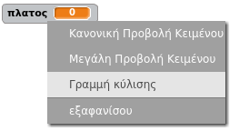
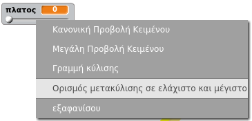

## Αλλαγή του πλάτους του μολυβιού

Ας επιτρέψουμε στο χρήστη να σχεδιάζει χρησιμοποιώντας μια σειρά διαφορετικών μεγεθών μολυβιού.

+ Αρχικά, πρόσθεσε μία νέα μεταβλητή που ονομάζεται `πλάτος`{:class="blockvariable"}.

[[[generic-scratch-add-variable]]]

+ Πρόσθεσε αυτή τη γραμμή *μέσα* στο βρόχο `για πάντα`{:class="blockcontrol"} του κώδικα του μολυβιού:

```blocks
    όρισε το μέγεθος πένας σε (πλάτος)
```

Το πλάτος του μολυβιού θα ρυθμιστεί επανειλημμένα στην τιμή της μεταβλητής 'πλάτος'.

+ Κάνε δεξί κλικ στη μεταβλητή που φαίνεται στο σκηνικό και ξανά κλικ στο "ρυθμιστικό".



Τώρα μπορείς να σύρεις το ρυθμιστικό κάτω από τη μεταβλητή για να αλλάξεις την τιμή.


+ Δοκίμασε το έργο σου και δες εάν μπορείς να τροποποιήσεις το πλάτος του μολυβιού.


Αν προτιμάς, μπορείς να ορίσεις την ελάχιστη και τη μέγιστη τιμή του "πλάτους" που επιτρέπεται. Για να το κάνεις αυτό, κάνε δεξί κλικ στη μεταβλητή και ξανά κλικ στο 'ορισμός μετακύλισης σε ελάχιστο και μέγιστο'. Όρισε τις ελάχιστες και μέγιστες τιμές της μεταβλητής σου σε κάτι πιο λογικό, όπως 1 και 20.



Συνέχισε να δοκιμάζεις τη μεταβλητή "πλάτος" μέχρι να είσαι ικανοποιημένος.