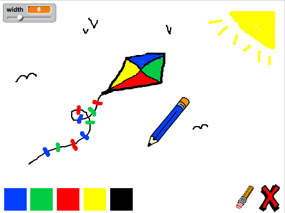

--- challenge ---

## Πρόκληση: περισσότερα μολύβια

Μπορείς να προσθέσεις κόκκινο, κίτρινο και μαύρο μολύβι στο πρόγραμμα ζωγραφικής; Ρίξε μια ματιά στο βήμα 2 παραπάνω εάν έχεις ξεχάσει πώς να το κάνεις. Θυμήσου επίσης να προσθέσεις συντομεύσεις πληκτρολογίου για αυτά τα νέα μολύβια.

Μπορείς να χρησιμοποιήσεις τα μολύβια σου για να σχεδιάσεις μια εικόνα;

--- /challenge ---
***
### Κοινοτική συνεισφορά μετάφρασης

Το έργο αυτό μεταφράστηκε από Γιώργος Νικολαΐδης και αναθεωρήθηκε από Δήμητρα Θεοδώρου. 

Οι εκπληκτικοί μας εθελοντές-μεταφραστές μας βοηθούν να δώσουμε στα παιδιά όλου του κόσμου την ευκαιρία να μάθουν να προγραμματίζουν. Μπορείτε να μας βοηθήσετε να προσεγγίσουμε περισσότερα παιδιά μεταφράζοντας τα έργα μας - διαβάστε περισσότερα στο [rpf.io/translators](https://rpf.io/translators).
