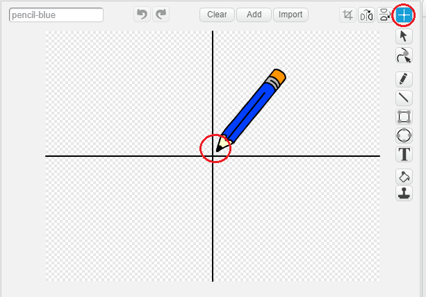

## Make a pencil

Start by making a pencil that you can use to draw on the Stage.

--- task ---
Open the 'Paint box' Scratch [starter project](http://rpf.io/p/en/paint-box-scratch2-go){:target="_blank"} in the offline editor.

If you need to download and install the Scratch offline editor, you can find it at [rpf.io/scratchoff](http://rpf.io/scratchoff)

In the starter project, you should see pencil and eraser sprites:


--- /task ---

--- task ---

Add some code to the pencil sprite to make the sprite follow the mouse pointer `forever`{:class="blockcontrol"} so that you can draw:


```blocks
when flag clicked
forever
  go to [mouse pointer v]
end
```

--- /task ---

--- task ---
Click the flag and then move the mouse pointer around the Stage to test whether your code works.
--- /task ---

Next, make your pencil only draw `if`{:class="blockcontrol"} the mouse button is being clicked.

--- task ---
Add this code to your pencil sprite:

```blocks
when flag clicked
forever
  go to [mouse pointer v]
+ if <mouse down?> then
  pen down
  else
  pen up
end
```
--- /task ---

--- task ---
Test your code again. This time, move the pencil around the Stage and hold down the mouse button. Can you draw with your pencil?


--- /task ---

--- collapse ---
---
title: Does your pencil not draw from its tip?
---
If the line your pencil draw looks like it is coming from the pencil's middle, you need to change your pencil sprite's costume centre.

Click on the pencil sprite, and then click on the **Costumes** tab.

Use the crosshair tool and move the costume's centre to be **just below** the tip of the pencil, not directly on the tip of the pencil.



After moving the crosshair to change the costume's centre, click on another costume or on the Scripts tab. Doing this tells Scratch that your changes to the costume's centre are complete.

Now move the pencil around on the Stage and draw. The pencil should now draw a line from its tip.

--- /collapse ---
