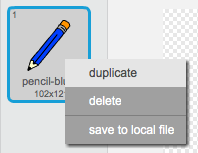
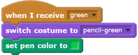
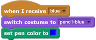
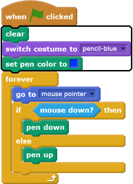

## Coloured pencils

Now you're going to add different coloured pencils to your project and allow the user to choose between them.

--- task ---
Click on the pencil sprite, click on **Costumes**, and duplicate the 'pencil-blue' costume.

--- /task ---

--- task ---
Name the new costume 'pencil-green', and colour the pencil green.

--- /task ---

--- task ---
Draw two new sprites: one blue square and one green square. These are for choosing between the blue and green pencil.

--- /task ---

--- task ---
Rename the new sprites so that they are called 'blue' and 'green'

[[[generic-scratch-rename-sprite]]]

--- /task ---

--- task ---
Add some code to the 'green' sprite so that when this sprite is clicked, it `broadcasts`{:class="blockevents"} the message "green".

[[[generic-scratch-broadcast-message]]]
--- /task ---

The pencil sprite should listen for the "green" message and change its costume and pencil colour in response.

--- task ---
Switch to your pencil sprite. Add some code so that when this sprite receives the `green`{:class="blockevents"} broadcast, it switchs to the green pencil costume and changes the pen colour to green.

To set the pencil to colour to green, click the coloured square in the `set pen color`{:class="blockpen"} block, and then click on the green square sprite.
--- /task ---

Then to a similar thing so that you can switch the pencil colour to blue.

--- task ---
Click on the blue square sprite and add this code:

Then click on the pencil sprite and add this code:

--- /task --- 

--- task ---
Finally, add this code to tell the pencil sprite which colour to start with, and to make sure that the screen is clear when your prom starts.

--- /task ---

If you prefer, you can start with a different colour pencil.

--- task ---
Test your code. Can you switch between the blue and green pencil colours by clicking on the blue or green square sprites?

--- /task ---

