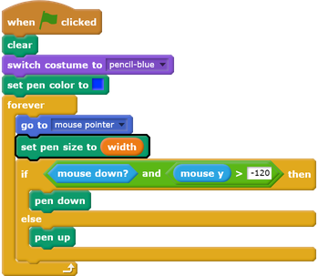
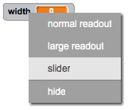

## Change the pen width

Next you will add code to allow the person using your program to draw things with different pen widths.

--- task ---
First, add a new variable called `width`{:class="blockdata"}.

[[[generic-scratch-add-variable]]]
--- /task ---

--- task ---
Add this line __inside__ the `forever`{:class="blockcontrol"} loop of the pencil sprite's code:

--- /task ---

The pen width now repeatedly gets set to the value of the `width`{:class="blockdata"} variable.

--- task ---
Right-click on the `width`{:class="blockdata"} variable displayed on the Stage, and then click on **slider**.

--- /task ---

You can now drag the slider that is visible below the variable to change the variable's value.

--- task ---
Test your project and see if you can add code to adjust the pen width.

--- /task ---

If you prefer, you can set a minimum and maximum value of `width`{:class="blockdata"}. To do this, right-click on the variable again and click on **set slider min and max**. Set the minimum and maximum values to something around 1 and 20.

Keep testing your `width`{:class="blockdata"} variable until you're happy with how much you can adjust the pen width.
