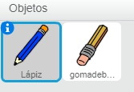
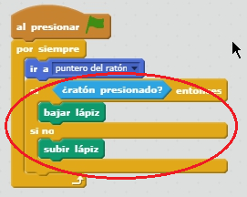
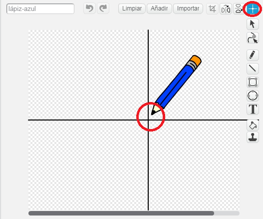

## Hacer un lápiz

Comencemos haciendo un lápiz que se pueda usar para dibujar en el escenario.

+ Abre el proyecto 'Paintbox' de Scratch online en [rpf.io/paint-go-es-ES](http:/rpf.io/paint-go-es-ES){:target="_blank"} o descárgalo primero de <http://rpf.io/paint-get-es-ES>{:target="_blank"} y ábrelo luego en tu editor offline.

Verás objetos lápiz y goma de borrar:



+ Añade algo de código al objeto del lápiz para que siga el movimiento del ratón `por siempre`{:class="blockcontrol"} para que puedas dibujar:

```blocks
    al presionar bandera verde
por siempre 
  ir a [puntero del ratón v]
fin
```

+ Haz clic en la bandera y luego mueve el ratón por el escenario para comprobar si el código funciona.

Ahora vamos a hacer que tu lápiz solo dibuje `si`{:class="blockcontrol"} haces clic con el ratón.

+ Añade este código a tu objeto lápiz:



+ Vuelve a probar tu código. Esta vez, mueve el lápiz por el escenario y mantén presionado el botón del ratón. ¿Puedes dibujar con tu lápiz?


--- collapse ---
---
title: Si tienes problemas...
---
Si parece que el lápiz está dibujando la línea con el centro del lápiz en vez de con la punta, tienes que cambiar el centro del disfraz.



La cruz del lápiz debe colocarse **justo debajo** de la punta del lápiz, no encima de la punta del lápiz.

Los cambios en el 'centro de un disfraz' no quedan registrados hasta que se haga clic en otra pestaña, o sea que haz clic en otro disfraz o en la pestaña 'Programas' para guardar los cambios hechos en el centro del disfraz.

--- /collapse ---