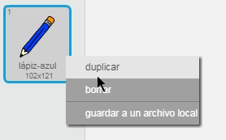
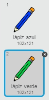
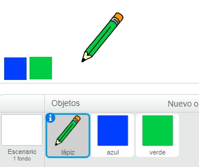
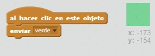
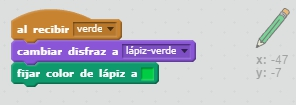
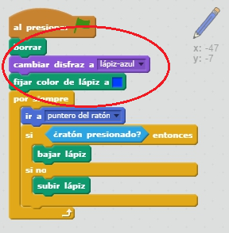

## Lápices de colores

Vamos a añadir diferentes lápices de colores a tu proyecto y a permitir al usuario elegir entre ellos.

+ Haz clic en tu objeto lápiz, luego haz clic en 'Disfraces' y duplica el disfraz 'lápiz-azul'.



+ Cambia el nombre de tu nuevo disfraz a 'lápiz-verde' y cambia el color del lápiz a verde.



[[[generic-scratch-rename-sprite]]]

+ Dibuja dos objetos más - un cuadrado azul y un cuadrado verde. Los usarás para seleccionar el lápiz de color azul o el lápiz de color verde.



+ Renombra tus objetos para que se llamen 'azul' y 'verde'

+ Añade código al objeto 'verde' de forma que cuando hagas clic encima de él `envíe`{:class="blockevents"} el mensaje 'verde' al objeto lápiz, indicándole que cambie su disfraz y su color.



[[[generic-scratch-broadcast-message]]]

+ Cambia al objeto lápiz. Añade código para que cuando este objeto reciba el mensaje `enviar`{:class="blockevents"} verde, cambie al disfraz de lápiz verde y cambie el color con el que dibuja el lápiz a verde.



Para ajustar el color con el que dibuja el lápiz a verde, haz clic en el cuadrado de color del bloque `fijar color del lápiz a`{:class="blockpen"}, y luego haz clic en el objeto verde para elegir el mismo color verde que el de tu lápiz.

+ Ahora puedes hacer lo mismo con el icono del lápiz azul: añade este código al objeto cuadrado azul:

```blocks
al hacer clic en este objeto
enviar [azul v]
```

... y añade este código al objeto lápiz:

```blocks
al recibir [azul v]
cambiar disfraz a [lápiz-azul v]
fijar color de lápiz a [#0000ff]
```

+ Para acabar, añade este código para decirle al objeto lápiz el color que tiene al inicio y para realizar un borrado de la pantalla.



Hemos elegido el color azul para empezar, pero si quieres, puedes cambiarlo por un color de lápiz distinto.

+ Prueba tu proyecto. ¿Puedes cambiar entre los objetos lápiz azul y verde haciendo clic encima de los objetos cuadrado azul y verde?

