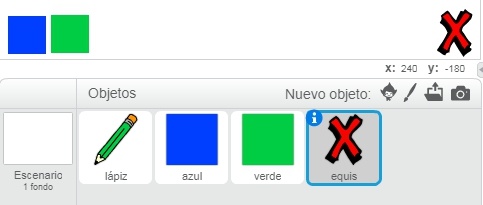
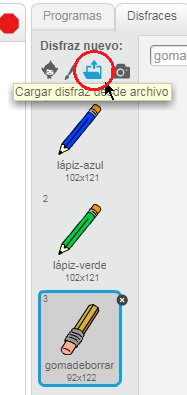
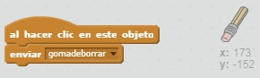

## Cometiendo errores

A veces nos equivocamos así que vamos a añadir un botón 'Limpiar' y una goma de borrar.

+ Añade el objeto 'X-block' que encontrarás en la biblioteca, en la sección de letras. Cambia el color del disfraz a rojo. Esto se convertirá en el botón de "limpiar".



+ Añade código a este objeto para que cuando lo cliques limpie el escenario.


Date cuenta que no necesitas enviar un mensaje para limpiar el escenario, puedes usar directamente el bloque 'borrar' con este objeto.

Habrás visto que el objeto lápiz incluye un disfraz de goma de borrar:



+ Tu proyecto también incluye un objeto goma de borrar aparte. Haz clic con el botón derecho encima de este objeto y elige 'mostrar'. El escenario debería quedar así:


+ Añade código al objeto 'goma de borrar' para decirle al lápiz que cambie a la goma de borrar cuando se haga clic en el objeto.



Cuando el lápiz recibe el mensaje 'gomadeborrar', puedes cambiar el disfraz del lápiz por el de la goma de borrar y cambiar el color de dibujo del lápiz a blanco - ¡el mismo color que el escenario!

+ Añade código para definir la goma de borrar

--- hints --- --- hint --- Añade código al objeto lápiz: **al recibir** el mensaje **borrar** **cambiar disfraz a** gomadeborrar **fijar color de lápiz a** blanco --- /hint --- --- hint --- El código para el objeto lápiz debería quedar así:

```blocks
al recibir [gomadeborrar v]
cambiar disfraz a [gomadeborrar v]
fijar color de lápiz a [#FFFFFF]
```

--- /hint --- --- /hints ---

+ Prueba tu proyecto para ver si puedes borrar en el escenario y limpiarlo del todo.


Hay un problema más con el lápiz - ¡puedes dibujar en cualquier lugar del escenario, incluso cerca de los iconos de selección!


Para arreglar esto, dile al lápiz que solo dibuje si haces clic con el ratón *y* la posición y del ratón es mayor que -120:


+ Prueba tu proyecto; ahora no deberías poder dibujar cerca de los bloques de selección.

