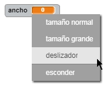
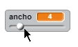
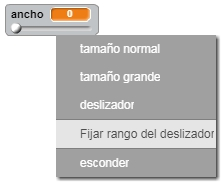

## Cambiamos el grosor del lápiz

Vamos a permitir al usuario dibujar usando diferentes tamaños de lápiz.

+ Primero añade una nueva variable llamada `ancho`{:class="blockvariable"}.

[[[generic-scratch-add-variable]]]

+ Añade esta linea *dentro* del bucle `por siempre`{:class="blockcontrol"} del código del lápiz:

```blocks
    fijar tamaño de lápiz a (ancho)
```

La anchura del lápiz se establecerá ahora con el valor de la variable 'ancho'.

+ Haz clic con el botón derecho en la esquina del escenario donde aparece la variable y haz clic en 'deslizador'.



Ahora puedes arrastrar el deslizador debajo de la variable para cambiar su valor.



+ Prueba tu proyecto y comprueba si puedes modificar el ancho del lápiz.


Si lo prefieres puedes fijar el valor mínimo y máximo permitido de 'ancho'. Para conseguirlo, vuelve a hacer clic con el botón derecho en la variable y luego haz clic en "Fijar rango del deslizador". Fija el valor mínimo y máximo de tu variable a algo más normal, como 1 y 20.



Sigue probando tu variable 'ancho' hasta dejarlo como tu quieras.