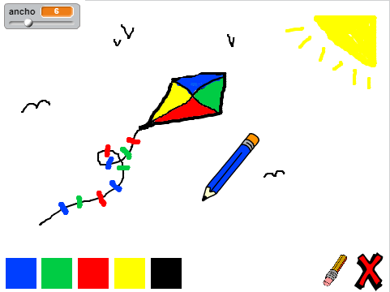

--- challenge ---

## Desafío: más colores

¿Puedes añadir los colores rojo, amarillo y negro a tu programa para dibujar? Mira el paso 2 anterior si has olvidado cómo hacerlo. Recuerda añadir atajos de teclado para estos nuevos colores también.

¿Puedes usar tus nuevos colores para hacer un dibujo?

--- /challenge ---

***
### Traducción aportada por la comunidad 

Este proyecto fue traducido por **María Alejandra Aguada, Montse Verdaguer & Helmut Schlimper** y revisado por **Pablo Collado**. 

Nuestros increíbles voluntarios de traducción nos ayudan a dar a los niños de todo el mundo la oportunidad de aprender a programar. Puedes ayudarnos a llegar a más niños traduciendo nuestros proyectos. Consigue más información en [rpf.io/translators](https://rpf.io/translators).
