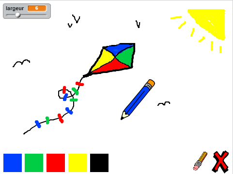

--- no-print ---

This is the **Scratch 2** version of the project. There is also a [Scratch 3 version of the project](https://projects.raspberrypi.org/fr-FR/projects/paint-box).

--- /no-print ---

## Introduction

Dans ce projet, Tu vas créer ton propre programme de peinture !

### Ce que tu feras

Clique sur le drapeau vert pour démarrer. Utilise la souris pour bouger le crayon et maintiens le bouton gauche de la souris enfoncé pour dessiner. Clique sur une couleur pour changer de crayon ou clique sur la gomme et utilise la pour effacer ton travail. Pour effacer la page, clique sur la croix.

  <iframe allowtransparency="true" width="485" height="402" src="https://scratch.mit.edu/projects/embed/249784795/?autostart=false" frameborder="0"></iframe>
  

### Ce que tu vas apprendre

Ce projet couvre des éléments des sections suivantes du [Raspberry Pi Digital Making Curriculum](http://rpf.io/curriculum){:target="_blank"}:

+ [Combiner des éléments de programmation pour résoudre un problème.](https://www.raspberrypi.org/curriculum/programming/builder){:target="_blank"}

### Informations supplémentaires pour les éducateurs

Si tu as besoin d'imprimer ce projet, merci d'utiliser la [ Version imprimable ](https://projects.raspberrypi.org/fr-FR/projects/paint-box-scratch2/print){:target="_blank"}.

Utilise le lien en pied de page pour accéder au dépot GitHub de ce projet, qui contient toutes les ressources (y compris un exemple du projet terminé) dans le dossier 'fr-FR/resources'.