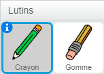
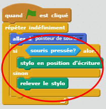
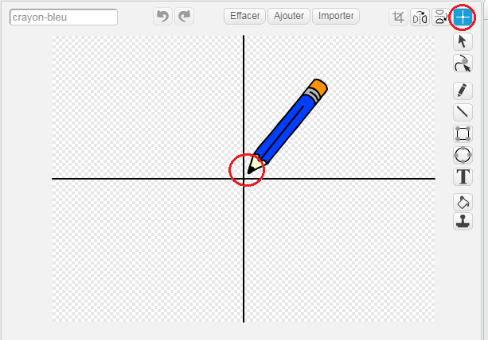

## Faire un crayon

Commençons par faire un crayon qui peut être utilisé pour dessiner sur la scène.

+ Ouvre le projet Scratch 'Paintbox' en ligne sur [rpf.io/paint-go-fr-FR](http://rpf.io/paint-go-fr-FR){:target="_blank"} ou télécharge-le depuis <http://rpf.io/paint-get-fr-FR>{:target="_blank"}, puis ouvre-le si tu utilises l'éditeur hors ligne.

Tu verras les lutins du crayon et de la gomme :



+ Ajoute du code au lutin du crayon pour lui faire suivre la souris `pour toujours`{:class="blockcontrol"} pour que tu puisses dessiner :

```blocks
    quand le drapeau vert pressé
répéter indéfiniment
   aller à [pointeur de souris v]
fin
```

+ Clique sur le drapeau vert, puis déplace la souris sur la scène pour tester si le code fonctionne.

Ensuite, faisons en sorte que ton crayon ne dessine que `si`{:class="blockcontrol"} le bouton gauche de la souris est enfoncé.

+ Ajoute ce code à ton lutin de crayon :



+ Teste ton code à nouveau. Cette fois, déplace le crayon sur la scène et maintiens le bouton gauche de la souris enfoncé. Peux-tu dessiner avec ton crayon ?


--- collapse ---
---
title: Si tu as des problèmes ...
---
Si ton crayon semble dessiner depuis son milieu plutôt que de sa pointe, tu devrais changer le centre du costume.



Le pointeur du crayon doit être placé **juste en dessous** de la pointe du crayon, pas sur la pointe du crayon.

Un changement dans le centre du costume d'un lutin n'est pas enregistré tant qu'un autre onglet n'est pas cliqué, alors clique sur un autre costume, ou sur l'onglet 'Scripts' pour finaliser tes changements de centre de costume.

--- /collapse ---