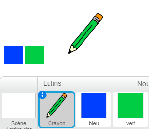

## Crayons de couleurs

Ajoutons des crayons de couleurs différentes à ton projet, et permettons à l'utilisateur de choisir entre eux.

+ Clique sur ton lutin crayon, clique sur «Costumes» et duplique ton costume «crayon-bleu».


+ Renomme ton nouveau costume «crayon-vert» et colore le crayon en vert.


[[[generic-scratch-rename-sprite]]]

+ Dessine deux nouveaux lutins - un carré bleu et un carré vert. Tu les utiliseras pour sélectionner le crayon bleu ou le crayon vert.



+ Renomme tes lutins pour qu'ils soient appelés "bleu" et "vert"

+ Ajoute du code au lutin "vert" de sorte que lorsque tu cliques dessus, il `diffuse`{:class="blockevents"} le message "vert" au lutin crayon, lui disant de changer sa couleur de costume et de stylo.


[[[generic-scratch-broadcast-message]]]

+ Passe à ton lutin crayon. Ajoute du code afin que lorsque ce lutin reçoit le `message`{:class="blockevents"} vert, il passe au costume vert et change la couleur du stylo au vert.


Pour mettre le stylo du lutin crayon en vert, clique sur la case de couleur dans la `mettre la couleur du stylo`{:class="blockpen"} bloc, et clique sur le lutin vert pour choisir la même couleur verte que la couleur de votre crayon.

+ Tu peux maintenant faire la même chose pour le message bleu. Ajoute ce code au lutin bleu :

```blocks
quand ce lutin est cliqué
 envoyer à tous [bleu v]
```

... et ajoute ce code à ton lutin crayon :

```blocks
quand je reçois [vert v]
 basculer sur le costume [crayon-vert v]
 mettre la couleur du stylo à [#00ff00
```

+ Enfin, ajoute ce code pour indiquer au lutin crayon la couleur de départ et s'assurer que l'écran est vide.


Nous avons choisi de commencer avec le bleu mais si tu préfères, Tu peux commencer avec un crayon de couleur différente.

+ Teste ton projet. Peux-tu basculer entre les crayons bleus et verts en cliquant sur les lutins carrés bleus ou verts ?

