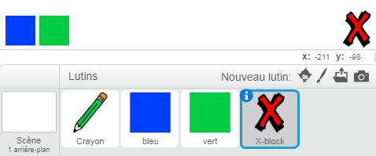
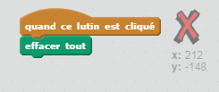
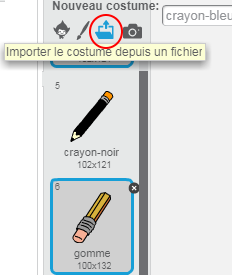
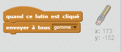
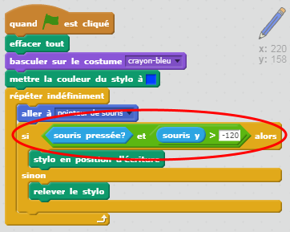

## Faire des erreurs

Parfois, des erreurs se produisent, alors ajoutons un bouton "effacer" et une gomme.

+ Ajoute le luttin 'X-block' - tu le trouveras dans la bibliothèque, dans la catégorie "Lettres". Colore le costume en rouge. Cela deviendra le bouton "effacer".



+ Ajoute du code à ce lutin pour effacer la scène lorsqu'il est cliqué.



Note que tu n'as pas besoin d'envoyer un message pour effacer la scène, tu peux simplement utiliser le bloc "effacer tout" de ce lutin.

Tu as probablement remarqué que votre lutin crayon comprend un costume de gomme :



+ Ton projet comprend également un lutin gomme distinct. Fais un clic droit sur ce lutin et choisis "Montrer". Voici à quoi ta scène devrait ressembler :


+ Ajoute du code au lutin de la gomme, pour indiquer au crayon de passer au costume gomme lorsque le lutin gomme est cliqué.



Lorsque le crayon reçoit le message "gomme", tu peux passer du costume crayon au costume gomme, et passer la couleur de crayon à blanc - la même couleur que la scène !

+ Ajoute du code pour créer la gomme

--- hints --- --- hint --- Ajoutons un peu de code au lutin crayon : **Quand je reçois** **gomme** **Basculer sur le costume** gomme **Mettre la couleur du stylo à** blanc --- /hint --- --- hint --- Voici à quoi devrait ressembler le code du lutin crayon :

```blocks
quand je reçois [gomme v]
basculer sur le costume [gomme v]
mettre la couleur du stylo à [#ffffff]
```

--- /hint --- --- /hints ---

+ Teste ton projet, pour voir si tu peux gommer sur la scène et même effacer toute la scène.


Il y a encore un problème avec le crayon - tu peux dessiner n'importe où sur la scène, y compris près des lutins de sélection !


Pour résoudre ce problème, dis au crayon de ne dessiner que si tu cliques sur la souris *et* si la position y de la souris est supérieure à -120 :



+ Teste ton projet ; tu ne devrais plus être en mesure de te rapprocher des lutins de sélection.

