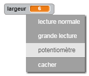
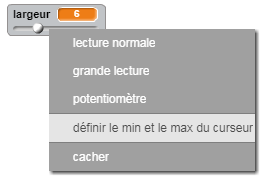

## Changer l'épaisseur du trait

Permettons à l'utilisateur de dessiner en utilisant une gamme de largeurs de traits différentes.

+ D'abord, ajoute une nouvelle variable appelée `largeur`{:class="blockvariable"}.

[[[generic-scratch-add-variable]]]

+ Ajoute cette ligne *à l'intérieur* de la boucle `pour toujours`{:class="blockcontrol"} du code du lutin crayon :

```blocks
    mettre la taille du stylo à (largeur)
```

L'épaisseur du trait du stylo sera maintenant toujours liée à la valeur de la variable 'largeur'.

+ Fais un clic droit sur l'affichage de la variable "largeur" sur la scène et clique sur "potentiomètre".



Tu peux maintenant faire glisser le curseur sous la variable pour changer sa valeur.


+ Teste ton projet et vois si tu peux modifier l'épaisseur du trait du crayon.


Si tu préfères, tu peux définir la valeur minimale et maximale de «largeur» autorisée. Pour ce faire, clique à nouveau sur la variable avec le bouton droit de la souris et clique sur "Définir le min et le max du curseur". Définissez les valeurs minimum et maximum de votre variable à quelque chose de plus judicieux, comme 1 et 20.



Continue à tester ta variable "largeur" ​​jusqu'à ce que tu sois satisfait.