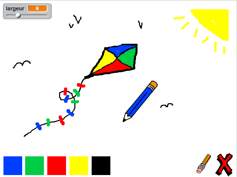

--- challenge ---

## Défi : plus de crayons

Peux-tu ajouter des crayons rouges, jaunes et noirs à ton programme de peinture ? Jette un œil à l'étape 2 ci-dessus si tu as oublié comment faire. N'oublie pas d'ajouter des raccourcis clavier pour ces nouveaux crayons aussi.

Peux-tu utiliser tes crayons pour faire un dessin ?

--- /challenge ---

***
### Traduction de la communauté 

Ce projet a été traduit par **Cyril Cauchois** et vérifié par **Simon Gleises**. 

Nos incroyables bénévoles de traduction nous aident à donner aux enfants du monde entier la chance d'apprendre à coder. Vous pouvez nous aider à atteindre plus d'enfants en traduisant nos projets - en savoir plus sur [rpf.io/translators](https://rpf.io/translators).
