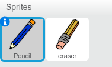

## पेंसिल बनाना

चलिए ऐसी पेंसिल बनाने से आंरभ करें, जिसे स्टेज पर चित्र बनाने के लिए उपयोग किया जा सकता है।


+ <a href="http://jumpto.cc/paint-go" target="_blank">jumpto.cc/paint-go</a> पर ऑनलाइन 'पेंटबॉक्स' Scratch प्रोजेक्ट खोलें या <a href="http://jumpto.cc/paint-get" target="_blank">jumpto.cc/paint-get</a> से डाउनलोड करें और फिर इसे खोलें यदि आप ऑफ़लाइन एडिटर का उपयोग कर रहे हैं।

	आपको पेंसिल और इरेज़र स्प्राइट्स दिखाई देंगी:

		

+ चूँकि आप चित्र बनाने के लिए माउस का उपयोग करेंगे, इसलिए आप चाहेंगे कि पेंसिल `हमेशा के लिए`{:class="blockcontrol"} माउस की राह पर चले। इस कोड को अपनी पेंसिल स्प्राइट में जोड़ें:

	```blocks
	    जब ⚑ क्लिक किया गया हो
      हमेशा के लिए 
        [mouse pointer v] पर जाएँ
      end
	```

+ फ्लैग पर क्लिक करके और फिर स्टेज पर माउस को स्थानांतरित करके इस कोड का परीक्षण करें। 

+ इसके बाद, चलिए पेंसिल को चित्र बनाने दें `अगर`{:class="blockcontrol"} माउस पर क्लिक किया जाए। इस कोड को अपनी पेंसिल स्प्राइट में जोड़ें:

		

+ अपने कोड का पुनः परीक्षण करें। इस बार, पेंसिल को स्टेज पर स्थानांतरित करें और माउस बटन दबाए रखें। क्या आप अपनी पेंसिल से चित्र बना सकते हैं?

	
	


