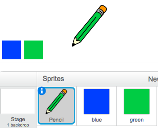
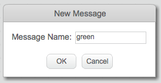

## रंगीन पेन

चलिए आपके प्रोजेक्ट में भिन्न-भिन्न रंगों के पेन जोड़ें, और उपयोगकर्ता को उनमें से चुनने की अनुमति दें!


+ अपनी पेंसिल स्प्राइट पर क्लिक करें, 'पोशाक' पर क्लिक करें और अपनी 'पेंसिल-नीली' पोशाक की नकल बनाएँ।

	

+ अपनी नई पोशाक 'पेंसिल-हरी' को नया नाम दें, और पेंसिल को हरे रंग में रंग दें।

	

+ दो नई स्प्राइट बनाएँ, जिनका आप नीली या हरी पेंसिल चुनने के लिए उपयोग करेंगे।

	

+ जब हरे सिलेक्टर आइकन पर क्लिक किया जाता है, तो आपको पेंसिल स्प्राइट को संदेश `प्रसारण करें`{:class="blockevents"} प्रसारित करना होता है, जिससे आप इसे इसकी पोशाक और पेंसिल का रंग बदलने के लिए कहते हैं।

	ऐसा करने के लिए, पहले इस कोड को हरे सिलेक्टर आइकन में जोड़ें:

	```blocks
		इस स्प्राईट को क्लिक करने पर
		[हरा v] प्रसारण करें
	```

	`प्रसारण करें`{:class="blockevents"} ब्लॉक बनाने के लिए, नीचे के तीर पर क्लिक करें और 'नया संदेश...' चुनें।

	

	अपना नया संदेश बनाने के लिए, फिर आप 'हरा' टाइप कर सकते हैं।

	

+ आपको अब अपनी पेंसिल स्प्राइट को बताना होगा कि संदेश प्राप्त होने पर इसे क्या करना है। इस कोड को अपनी पेंसिल स्प्राइट में जोड़ें:

	```blocks
		मुझे [green v] मिलने पर
    पोशाक बदल कर [pencil-green v] करें
    पेन का रंग [#00ff00] पर सेट करे
	```

	पेंसिल को हरे रंग करने पर सेट करने के लिए, `रंग सेट करें`{:class="blockpen"} ब्लॉक में रंगीन बॉक्स पर क्लिक करें, और पेंसिल का हरा रंग चुनने के लिए हरे सिलेक्टर आइकन पर क्लिक करें।

+ आप इस कोड को नीले सिलेक्टर स्प्राइट में जोड़कर, नीले पेंसिल आइकन के साथ भी ऐसा ही कर सकते हैं:

	```blocks
		इस स्प्राईट को क्लिक करने पर
		[blue v] प्रसारण करें
	```

	...और इस कोड को पेंसिल स्प्राइट में जोड़ना:

	```blocks
		मुझे [blue v] मिलने पर
    पोशाक बदल कर [pencil-blue v] करें
    पेन का रंग [#0000ff] पर सेट करे
	```

+ अंततः आपको अपनी पेंसिल स्प्राइट को बताने की ज़रूरत है कि प्रोजेक्ट आरंभ होने पर स्क्रीन क्लियर करने के साथ किस पोशाक और पेंसिल का रंग चुनना है। इस कोड को पेंसिल के `जब ⚑ क्लिक किया गया हो`{:class="blockevents"} कोड (`हमेशा के लिए`{:class="blockcontrol"} लूप स पहले) के आंरभ में जोड़ें:

	```blocks
		मिटा दे
		पोशाक बदल कर [blue-pencil v] करें
		पेन का रंग [#0000ff] पर सेट करे
	```

	यदि आप चाहें, तो आप भिन्न रंग की पेंसिल से आरंभ कर सकते हैं!

+ अपने प्रोजेक्ट का परीक्षण करें। क्या आप हरे और नीले पेन के बीच स्विच कर सकते हैं?

	


