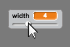

## पेंसिल की चौड़ाई में परिवर्तन करना

चलिए उपयोगकर्ता को पेंसिल के विभिन्न आकारों का उपयोग करके चित्र बनाने की अनुमति दें।


+ पहले, 'चौड़ाई' नामक नया वेरिएबल बनाएँ। यदि आप यकीनी तौर पर ऐसा करना न जानते हों, तो 'घोस्टबस्टर्स' प्रोजेक्ट आपकी सहायता करेगा।

+ इस लाइन को अपनी पेंसिल के कोड के `हमेशा के लिए`{:class="blockcontrol"} लूप के_अंदर_जोड़ें:

	```blocks
		पेन का अाकार (चौड़ाई) पर सेट करे
	```

	आपकी पेंसिल की चौड़ाई को अब बार-बार आपके 'चौड़ाई' वेरिएबल के मान पर सेट किया जाएगा।

+ आप अपने वेरिएबल पर  (स्टेज पर) राइट क्लिक करके और 'स्लाइडर' पर क्लिक करके इस वेरिएबल में स्टोर संख्या को बदल सकते हैं।

	

	अब आप स्लाइडर का मान बदलने के लिए इसे वेरिएबल के नीचे खींच  सकते हैं।

	

+ अपने प्रोजेक्ट का परीक्षण करें, और देखें कि क्या आप पेंसिल की चौड़ाई बदल सकते हैं।

	

	यदि आप चाहें, तो आप 'चौड़ाई' के अनुमति के न्यूनतम और अधिकतम मान सेट कर सकते हैं। ऐसा करने के लिए, अपने वेरिएबल पर पुनः राइट क्लिक करें और 'स्लाइडर न्यूनतम और अधिकतम पर सेट करें' पर क्लिक करें। अपने वेरिएबल का न्यूनतम और अधिकतम मान अधिक बुद्धिमत्तापूर्ण संख्या, जैसे 1 और 20 सेट करें।

	

	अपने 'चौड़ाई' वेरिएबल का तब तक परीक्षण करना जारी रखें, जब तक आप ख़ुश न हो जाएँ।


