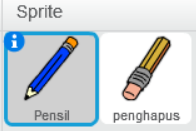
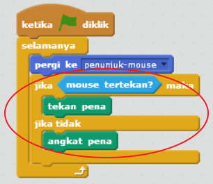
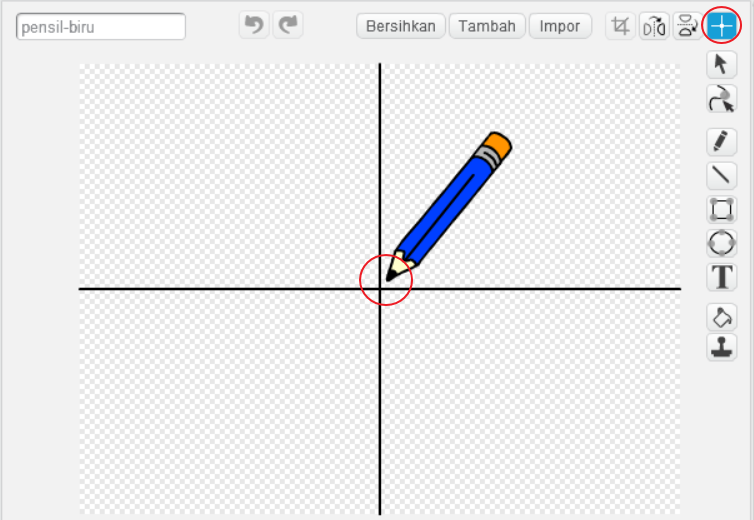

## Membuat pensil

Mari kita mulai dengan membuat pensil yang bisa digunakan untuk menggambar pada stage.

+ Buka proyek Scratch 'Paintbox' secara online di [rpf.io/paint-go-id-ID](http://rpf.io/paint-go-id-ID){:target="_blank"} atau unduh dari <http://rpf.io/paint-get-id-ID>{:target="_blank"} kemudian buka menggunakan editor offline.

Kamu akan melihat sprite pensil dan penghapus:



+ Tambahkan beberapa code ke sprite pensil untuk membuatnya mengikuti mouse `selamanya`{:class="blockcontrol"} sehingga kamu dapat menggambar:

```blocks
    ketika bendera diklik
    selamanya
      pergi ke [penunjuk-mouse v]
```

+ Klik bendera dan gerakkan mouse di sekitar stage untuk menguji apakah kode berfungsi.

Selanjutnya, mari kita buat pensil kamu hanya menggambar `jika`{:class="blockcontrol"} mouse telah diklik.

+ Tambahkan kode ini ke sprite pensil kamu:



+ Uji kode kamu lagi. Kali ini, gerakkan pensil di sekitar stage dan tahan tombol mouse. Dapatkah kamu menggambar dengan pensilmu?


--- collapse ---
---
title: Jika kamu mengalami masalah...
---
Jika pensil kamu tampaknya menggambar garis dari tengah daripada ujung pensil, kamu harus mengubah pusat kostum kamu.



Bidik silang untuk pensil harus ditempatkan **sedikit di bawah** ujung pensil, bukan tepat di ujung pensil.

Perubahan pada 'pusat kostum' sprite tidak tersimpan sampai tab lain diklik, jadi klik pada kostum lain, atau pada tab 'Skrip' untuk menyimpan perubahan kamu pada pusat kostum.

--- /collapse ---