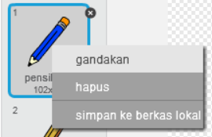
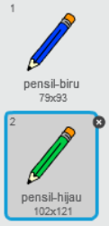
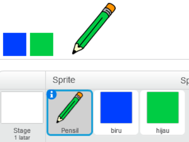
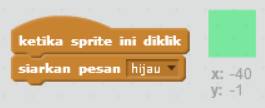
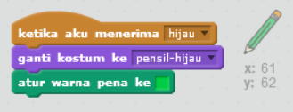
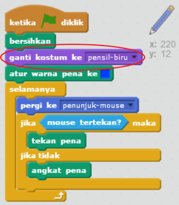

## Pensil berwarna

Mari kita tambahkan pensil berwarna lain ke proyek kamu, dan bolehkan pengguna untuk memilih di antara mereka.

+ Klik sprite pensil kamu, klik 'Kostum' dan gandakan kostum 'pensil-biru' kamu.



+ Ganti nama kostum baru menjadi 'pensil-hijau', dan warnai pensil hijau.



[[[generic-scratch-rename-sprite]]]

+ Gambar dua sprite baru - satu kotak biru dan satu kotak hijau. Kamu akan menggunakan mereka untuk memilih pensil biru atau hijau.



+ Ganti nama sprite kamu sehingga mereka disebut 'biru' dan 'hijau'

+ Tambahkan beberapa kode ke sprite 'hijau' sehingga ketika diklik, pesan "hijau" akan di-`siarkan`{:class="blockevents"} ke sprite pensil, memberitahu dia untuk mengubah kostum dan warnanya.



[[[generic-scratch-broadcast-message]]]

+ Beralih ke sprite pensil kamu. Tambahkan beberapa kode sehingga ketika sprite ini menerima `siarkan`{:class="blockevents"} hijau, dia harus beralih ke kostum pensil hijau dan mengubah warnanya menjadi hijau.



Untuk mengatur pensil ke warna hijau, klik kotak berwarna di blok `atur warna pena`{:class="blockpen"}, dan klik pada sprite hijau untuk memilih warna hijau tersebut sebagai warna pensil kamu.

+ Kamu sekarang dapat melakukan hal yang sama untuk ikon pensil biru: tambahkan kode ini ke sprite kotak biru:

```blocks
ketika sprite ini diklik
siarkan pesan [biru v]
```

...dan tambahkan kode ini ke sprite pensil:

```blocks
ketika aku menerima [biru v]
ganti kostum ke [pensil-biru v]
atur warna pena ke [#0000ff]
```

+ Terakhir, tambahkan kode ini untuk memberi tahu sprite pensil soal warna mana yang akan digunakan untuk memulai, dan pastikan layarnya bersih.



Kita memilih untuk memulai dengan warna biru tapi jika kamu suka, kamu dapat memulai dengan pensil berwarna lain.

+ Uji proyek Kamu. Dapatkah Kamu beralih antara pena biru dan hijau dengan mengklik sprite kotak biru atau hijau?

