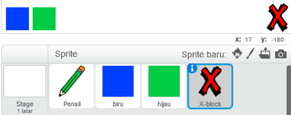
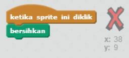
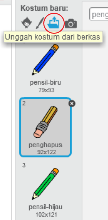
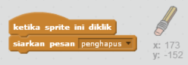
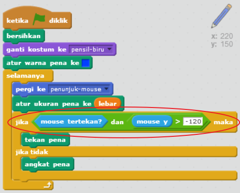

## Membuat kesalahan

Terkadang kesalahan terjadi, jadi mari kita tambahkan tombol 'bersihkan' dan penghapus.

+ Tambahkan sprite 'X-block' - kamu akan menemukannya di pustaka, pada bagian huruf. Warnai kostum dengan warna merah. Ini akan menjadi tombol 'bersihkan'.



+ Tambahkan kode ke sprite ini untuk membersihkan stage saat diklik.



Perhatikan bahwa kamu tidak perlu mengirim pesan untuk membersihkan stage, kamu dapat menggunakan blok 'bersihkan' dari sprite ini.

Kamu mungkin memperhatikan bahwa sprite pensil kamu memiliki kostum penghapus:



+ Proyek kamu juga memiliki sprite penghapus terpisah. Klik kanan pada sprite ini dan pilih 'tampilkan'. Berikut bagaimana stage kamu seharusnya tampak:


+ Tambahkan kode ke sprite penghapus, untuk memberi tahu pensil untuk beralih ke penghapus ketika sprite diklik.



Ketika pensil menerima pesan "penghapus", kamu dapat mengalihkan kostum pensil ke penghapus, dan mengganti warna pensil menjadi putih - warna yang sama dengan stage!

+ Tambahkan beberapa kode untuk membuat penghapus

--- hints --- --- hint --- Tambahkan beberapa kode ke sprite pensil: **Ketika aku menerima** pesan **penghapus** **Ganti kostum ke** penghapus **Atur warna pena ke** putih --- /hint --- --- hint --- Berikut bagaimana kode pada sprite pensil seharusnya tampak:

```blocks
ketika aku menerima [penghapus v]
ganti kostum ke [penghapus v]
atur warna pena ke [#FFFFFF]
```

--- /hint --- --- /hints ---

+ Uji proyek kamu untuk melihat dapatkah kamu membersihkan dan menghapus pada stage.


Ada satu lagi masalah dengan pensil - kamu dapat menggambar di mana saja pada stage, termasuk di dekat ikon pemilih!


Untuk memperbaikinya, beri tahu pensil hanya untuk menggambar jika mouse diklik *dan* jika posisi-y mouse lebih besar dari -120:



+ Uji proyek kamu; kamu sekarang seharusnya tidak dapat menggambar di dekat blok pemilih.

