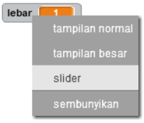
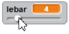
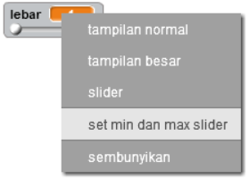

## Mengubah lebar pensil

Mari kita ijinkan pengguna untuk menggambar dengan beragam ukuran pensil yang berbeda.

+ Pertama, tambahkan variabel baru bernama `lebar`{:class="blockvariable"}.

[[[generic-scratch-add-variable]]]

+ Tambahkan baris ini *di dalam* pengulangan `selamanya`{:class="blockcontrol"} pada kode pensil:

```blocks
    atur ukuran pena ke (lebar)
```

Lebar pensil sekarang akan berulang kali diatur ke nilai variabel 'lebar'.

+ Klik kanan pada tampilan variabel di stage dan klik 'slider'.



Kamu sekarang dapat menyeret slider di bawah variabel untuk mengubah nilainya.



+ Uji proyek kamu, dan lihat apakah kamu dapat mengubah lebar pensil.


Jika kamu suka, kamu dapat mengatur nilai terkecil dan terbesar dari 'lebar' yang dibolehkan. Untuk melakukan ini, klik kanan lagi pada tampilan variabel dan klik 'set min dan max slider'. Atur nilai terkecil dan terbesar dari variabel kamu ke sesuatu yang lebih masuk akal, seperti 1 dan 20.



Terus uji variabel 'lebar' sampai kamu puas.