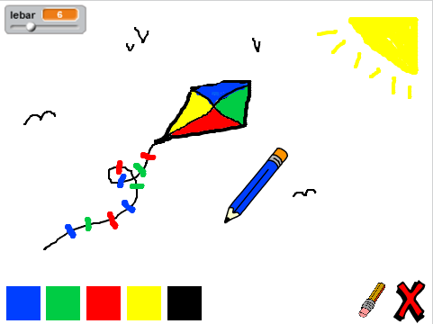

--- challenge ---

## Tantangan: pensil tambahan

Dapatkah kamu menambahkan pensil merah, kuning dan hitam ke program lukis kamu? Lihatlah langkah 2 di atas jika kamu lupa cara melakukannya. Ingatlah untuk menambahkan juga pintasan keyboard untuk pensil-pensil baru.

Dapatkah kamu menggunakan pensil-pensil kamu untuk menggambar satu lukisan?

--- /challenge ---

***
### Terjemahan Kontribusi Komunitas 

Proyek ini diterjemahkan oleh **Chris Permana** dan ditinjau oleh **Maksum Rifai**. 

Relawan penerjemah kami yang luar biasa membantu kami memberi kesempatan kepada anak-anak di seluruh dunia untuk belajar kode. Anda dapat membantu kami menjangkau lebih banyak anak dengan menerjemahkan proyek kami - baca lebih lanjut di [rpf.io/translators](https://rpf.io/translators).
