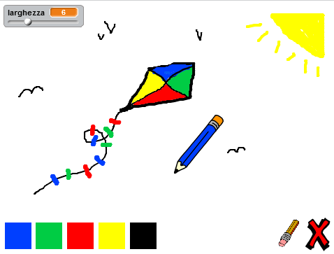

--- no-print ---

This is the **Scratch 2** version of the project. There is also a [Scratch 3 version of the project](https://projects.raspberrypi.org/it-IT/projects/paint-box).

--- /no-print ---

## Introduzione

Crea un programma per disegnare!

### Cosa creerai

Clicca sulla bandiera verde per cominciare. Utilizza il mouse per muovere la matita, e tieni premuto il pulsante sinistro per disegnare. Clicca su un colore per cambiare pastello, o clicca sulla gomma per cancellare il tuo disegno. Per cancellare tutto, clicca sulla x.

  <iframe allowtransparency="true" width="485" height="402" src="//scratch.mit.edu/projects/embed/219860138/?autostart=false" frameborder="0"></iframe>
  

### Cosa imparerai

Questo progetto include elementi tratti dalle seguenti componenti del [Digital Making Curriculum di Raspberry Pi](http://rpf.io/curriculum){:target="_blank"}:

+ [Combinare i costrutti di un linguaggio di programmazione per risolvere un problema.](https://www.raspberrypi.org/curriculum/programming/builder){:target="_blank"}

### Ulteriori informazioni per gli organizzatori dei club

Se intendete stampare questo progetto, cliccate su [Versione stampabile](https://projects.raspberrypi.org/it-IT/projects/paint-box-scratch2/print){:target="_blank"}.

Cliccare il link a piè di pagina per accedere alla repository di GitHub relativa a questo progetto, che contiene tutte le risorse necessarie (incluso un esempio di progetto completo) nella cartella 'it-IT/resources'.