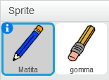
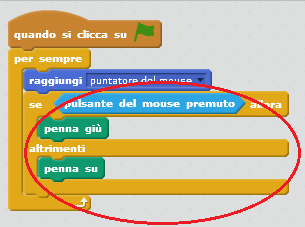
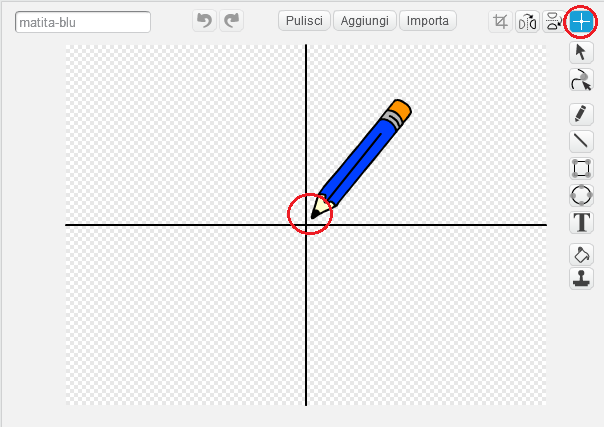

## Creare una matita

Iniziamo creando una matita che può essere usata per disegnare sul quadro.

+ Apri il progetto Scratch 'Scatola a Colori' online su [jumpto.cc/paint-go-it-IT](https://jumpto.cc/paint-go-it-IT), o scaricalo da [http://jumpto.cc/paint-get-it-IT](https://github.com/raspberrypilearning/paint-box-scratch2/raw/master/it-IT/resources/PaintBox.sb2) per usarlo con l'editor offline.

Vedrai gli sprite della matita e della gomma:



+ Aggiungi dei codici allo sprite della matita per far sì che segua il mouse `per sempre`{:class="blockcontrol"}, in modo da permetterti disegnare:

```blocks
quando si clicca sulla bandiera verde
per sempre 
  raggiungi [puntatore del mouse v]
fine
```

+ Fai click sulla bandierina e muovi il mouse sul quadro per verificare se il codice funzioni.

Ora facciamo in modo che la matita disegni solo `se`{:class="blockcontrol"} il mouse è stato cliccato.

+ Aggiungi questo codice allo sprite della tua matita:



+ Prova di nuovo il tuo codice. Questa volta, muovi la matita nel quadro e tieni premuto il tasto sinistro del mouse. Riesci a disegnare con la tua matita?


--- collapse ---
---
title: Se stai avendo problemi...
---
Se sembra che il disegno parta dal centro della matita, invece che dalla punta, hai bisogno di modificare il centro del tuo costume.



Il mirino della matita deve essere posizionato **appena sotto** la punta della matita, non sulla punta della matita.

Le modifiche apportate al 'centro del costume' di uno sprite saranno applicate solo dopo aver cliccato su un'altra scheda: clicca su un altro costume o sulla scheda 'Script' per rendere valide le tue modifiche.

--- /collapse ---
