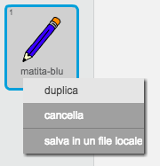
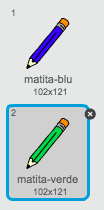
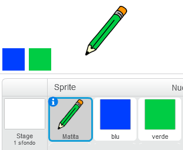
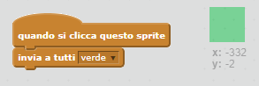
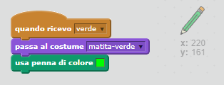
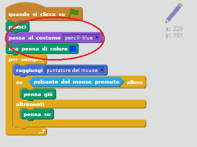

## Matite colorate

Aggiungiamo delle matite colorate al tuo progetto, e permettiamo all’utente di scegliere quella che preferisce.

+ Clicca sullo sprite della matita, clicca ‘Costumi’ e duplica il costume ‘matita-blu’.



+ Rinomina il tuo nuovo costume ‘matita-verde’, e colora la matita di verde.



[[[generic-scratch-rename-sprite]]]

+ Crea due nuovi sprite: un quadrato blu e un quadrato verde. Userai questi sprite per selezionare la matita blu o quella verde.



+ Rinomina i tuoi sprite 'blu' e 'verde'

+ Aggiungi dei codici allo sprite 'verde' per far sì che quando vi si clicca sopra `invii a tutti`{:class="blockevents"} il messaggio "verde", comunicando così allo sprite della matita di cambiare costume e colore.



[[[generic-scratch-broadcast-message]]]

+ Cambia sprite. Aggiungi dei codici per fare in modo che quando lo sprite riceve il messaggio `invia a tutti`{:class="blockevents"} "verde", il costume della matita e quello della penna diventino verdi.



Per fare in modo che quando disegni la linea sia verde, clicca la casella colorata nel blocco `imposta colore`, e clicca sull’icona verde per scegliere il verde come colore della matita.

+ Ora puoi fare la stessa cosa per l’icona della matita blu, aggiungendo questo codice allo sprite del quadrato blu:

```blocks
quando si clicca questo sprite
invia a tutti [blu v]
```

…e aggiungi questo codice allo sprite della tua matita:

```blocks
quando ricevo [blu v]
passa al costume [matita-blu v] 
usa penna di colore [#0000ff]
```

+ Infine, dovrai dire allo sprite della tua matita quale costume e quale colore di matita scegliere a inizio progetto, e anche di ripulire la schermata.



Abbiamo deciso di partire dal blu, ma se preferisci, puoi iniziare con una matita di colore diverso.

+ Prova il tuo progetto. Puoi intercambiare le matite blu e verde cliccando sugli sprite dei quadrati blu e verde?


