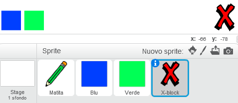
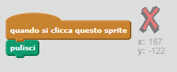
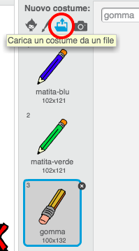
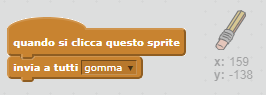
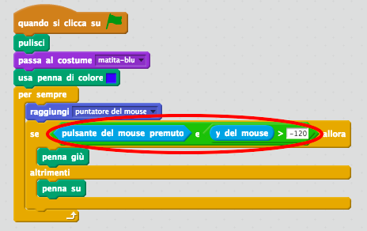

## Fare errori

A volte si può sbagliare, dunque aggiungiamo al tuo progetto il tasto ‘ripulisci’ e una gomma.

+ Aggiungi al quadro lo sprite della lettera ‘X-block’. Lo trovi nella libreria, nella sezione "Lettere". Colora il costume di rosso. Ecco il tuo tasto 'ripulisci'.



+ Aggiungi un codice al tuo nuovo tasto 'ripulisci' per ripulire il quadro quando viene cliccato.



Noterai che non è necessario mandare un messaggio per ripulire il quadro, perché puoi farlo da qualsiasi sprite!

Avrai probabilmente notato che lo sprite della matita include un costume da gomma:



+ Il tuo progetto include anche uno sprite per selezionare la gomma. Cliccalo col tasto destro e scegli ‘mostra’. Il tuo quadro dovrebbe apparire così:


+ Aggiungi un codice allo sprite della gomma per comunicare alla matita di diventare gomma quando si clicca su questo sprite.



Quando la matita riceve questo messaggio, puoi creare una gomma passando dal costume matita a quello di gomma, e cambiando il colore della matita per farlo diventare bianco: lo stesso colore del quadro!

+ Aggiungi dei codici per creare la gomma

--- hints --- --- hint --- Aggiungi dei codici allo sprite della matita: **Quando ricevo** il messaggio **gomma** **Passa al costume** gomma **Usa penna di colore** bianco --- /hint --- --- hint --- Ecco come dovrebbe apparire il codice all'interno dello sprite della matita:

```blocks
quando ricevo [gomma v]
passa al costume [gomma v] 
usa penna di colore [#FFFFFF]
```

--- /hint --- --- /hints ---

+ Prova il tuo progetto per verificare se puoi cancellare i disegni nel quadro.


C’è un altro problema con la matita - puoi disegnare dappertutto sul quadro, anche vicino alle icone selezionatrici!


Per risolvere questo problema, devi comunicare alla matita di disegnare solo se il mouse è cliccato *e* se la posizione y del mouse è maggiore di -120:



+ Prova il tuo progetto; ora non dovresti poter disegnare vicino ai blocchi selettori.

