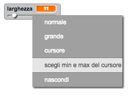

## Cambiare lo spessore della matita

Facciamo in modo che l’utente possa disegnare usando matite di spessore diverso.

+ Per prima cosa, aggiungiamo una nuova variabile chiamata `larghezza`{:class="blockvariable"}.

[[[generic-scratch-add-variable]]]

+ Aggiungi questa riga *dentro* il ciclo `per sempre`{:class="blockcontrol"} del codice della matita:

```blocks
    usa penna di dimensione (larghezza)
```

Lo spessore della matita ora verrà costantemente regolato in base al valore della variabile ‘larghezza’.

+ Fai click col pulsante destro del mouse sulla tua variabile nel quadro e clicca la barra di regolazione ('slider').


Ora puoi trascinare la barra sotto la variabile per cambiarne il valore.


+ Prova il tuo progetto e vedi se riesci a modificare lo spessore della matita.


Se preferisci, puoi impostare il valore massimo e minimo permesso per la ‘larghezza’. Per fare ciò, clicca di nuovo col pulsante destro sulla tua variabile e clicca ‘imposta slider minimo e massimo’. Imposta il valore minimo e massimo della tua variabile a 1 e 20.



Continua a provare la tua variabile ‘larghezza’ fino a raggiungere il valore desiderato.