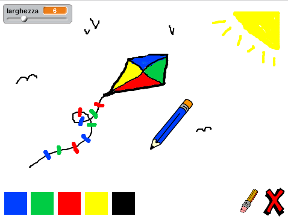

--- challenge ---

## Sfida: Più matite

Puoi aggiungere una matita rossa, una gialla e una nera al tuo programma di disegno? Dai un’occhiata al passo 2 se non ti ricordi come si fa. Ricordati di aggiungere delle scorciatoie a queste nuove penne.

Puoi usare le tue matite per fare un disegno?

--- /challenge ---
***
### Traduzioni della Community

Questo progetto è stato tradotto da **Silvia Caponio** e revisionato da **Alejandro Michetti**. 

Il nostro straordinario team di traduttori volontari ci permette di dare ai bambini di tutto il mondo la possibilità di imparare a programmare. Puoi aiutarci a raggiungere più bambini traducendo i nostri progetti - scopri di più su [rpf.io/translators](https://rpf.io/translators).
