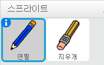
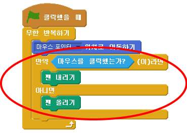
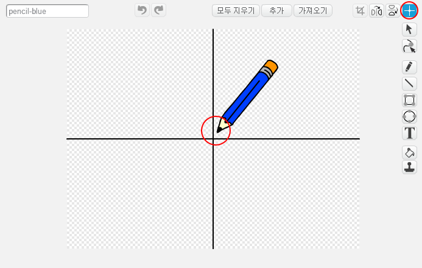

## 연필 만들기

무대에 그림을 그리는 데 사용되는 연필을 만드는 것으로 시작해 봅시다.

+ 'Paintbox' 스크래치 프로젝트를 온라인 [jumpto.cc/paint-go](https://scratch.mit.edu/projects/236625141/#editor){:target="_blank"} 에서 열거나 <http://jumpto.cc/paint-get>{:target="_black"} 을 다운로드 받아 오프라인 에디터에서 사용할 수 있는 프로젝트를 엽니다.

연필과 지우개 스프라이트를 볼 수 있습니다:



+ 그림을 그릴 수 있도록 연필 스프라이트가 마우스를 `무한반복하기` 로 따라다닐 수 있도록 몇개의 코드를 추가합니다:

```blocks
    ⚑ 클릭했을 때
무한 반복하기 
  [마우스 포인터 v] 위치로 이동하기
end
```

+ 깃발을 클릭하고 무대 주변으로 마우스를 움직여서 코드가 잘 동작하는지 테스트 해 봅시다.

다음으로, `만약`{:class="blockcontrol"} 마우스 버튼이 클릭됐을때만 연필이 그림을 그리도록 만들어 봅시다.

+ 이 코드를 연필 스프라이트에 추가 해 보세요:



+ 코드를 다시 테스트 해 보세요. 이번엔, 무대 주변으로 연필을 이동면서 마우스 버튼을 누르고 있어 보세요. 연필로 그림을 그릴 수 있나요?


--- collapse ---
---
title: 만약 문제가 생겼다면...
---
만약 연필 끝이 아니라 연필 중간에서 그림이 그려지는것 같다면, 연필의 모양 중심을 변경해야 합니다.



십자선은 연필심이 아니라 연필심 끝의 **바로 아래에** 있어야합니다.

스프라이트의 '모양 중심'은 다른 탭이 클릭될 때까지 적용되지 않으니, 다른 모양이나 '스크립트' 탭을 클릭해서 모양 중심 변경이 완료되게 하세요.

--- /collapse ---