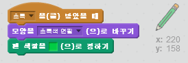
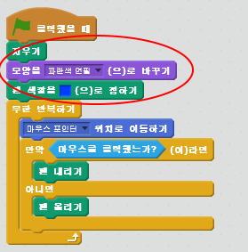

## 색연필

다른 색의 연필들을 추가해서 사용자가 색을 고를 수 있도록 해 봐요.

+ 연필 스프라이트를 클릭하고, '모양' 탭을 누른 후 '파란색 연필' 모양을 복사 해 주세요.


+ 새 모양의 이름을 ’녹색 연필’으로 바꾸고, 녹색으로 칠해주세요.


[[[generic-scratch-rename-sprite]]]

+ 새로운 사각형 스프라이트 두 개를 그려주세요. 파란색 하나, 녹색 하나. 어떤 색의 색연필을 사용할 지 선택할 때 이 스프라이트를 사용할 것입니다.


+ 새 스프라이트의 이름을 '파랑'과 '초록'으로 바꿔 주세요.

+ '초록' 스프라이트가 클릭되면, 초록 `방송하기`{:class="blockevents"} 를 연필 스프라이트에게 보내서 모양과 색을 바꿀 수 있도록 코드를 추가 해 주세요.


[[[generic-scratch-broadcast-message]]]

+ 연필 스프라이트로 돌아가세요. 이 스프라이트가 초록 `수신하기`{:class="blockevents"} 이벤트를 받으면, 녹색 연필 모양으로 바뀌고 연필 색깔을 녹색으로 바꾸는 코드를 추가 하세요.



연필 색을 녹색으로 정하기 위해서, `펜 색깔을 정하기`{:class="blockpen"} 블록의 색깔 박스를 클릭하고, 녹색 스프라이트를 클릭해서 연필이 녹색 스프라이트와 같은 색이 되도록 선택합니다.

+ 이제 파란 연필 아이콘에도 해 봅시다: 다음의 코드를 파란색 사각형 스프라이트에 추가 해 주세요.

```blocks
이 스프라이트가 클릭될 때
[파랑 v] 방송하기
```

...그리고 이 코드를 연필 스프라이트에 추가 해 주세요:

```blocks
[파랑 v] 을\(를\) 받았을 때
모양을 [파란색 연필 v] \(으\)로 바꾸기
펜 색깔을 [#0000ff] \(으\)로 정하기
```

+ 마지막으로, 연필 스프라이트가 어떤 색으로 시작하게 될지 알려주고 시작할 때 화면이 비어있는지 확인할 수 있도록 이 코드를 추가 하세요.



우리는 파란색으로 시작하도록 선택했지만, 원한다면 다른 색으로 시작해도 됩니다.

+ 프로젝트를 테스트 해 보세요. 파란색 사각형과 녹색 사각형을 클릭해서 연필의 색을 바꿀 수 있나요?

