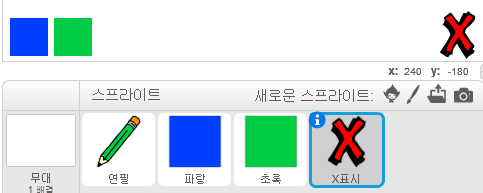
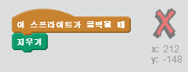
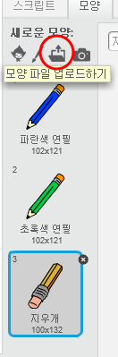
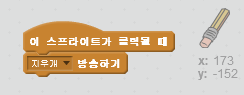
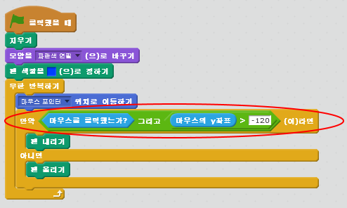

## 실수 해보기

언제든 실수는 할 수 있죠, 그러니 '다 지우기' 버튼과 지우개를 추가 해 봅시다.

+ 'X표시' 스프라이트를 추가하세요. 저장소의 글자들 섹션에서 찾을 수 있습니다. 모양을 빨간색으로 바꿔 주세요. 이게 '다 지우기' 버튼이 될 것입니다.



+ 이 버튼을 누르면 무대를 전부 지우도록 코드를 추가 해 봅시다.



무대를 지우기 위해 메세지를 보낼 필요는 없어요. 그냥 '지우기' 블럭을 사용하면 됩니다.

아마도 연필 스프라이트가 지우개 모양을 포함하고 있음을 눈치 챘을거에요.



+ 프로젝트에는 별도의 지우개 스프라이트가 포함되어 있습니다. 이 스프라이트를 우클릭하고 '보이기'를 선택합니다. 이제 무대는 다음처럼 보여야 합니다:


+ 지우개 스프라이트가 클릭되면 연필이 지우개로 바뀔 수 있도록 코드를 추가합시다.



연필이 "지우개" 메세지를 받으면, 연필의 모양을 지우개로 바꾸고, 연필의 색을 스테이지 색과 똑같이 흰색으로 바꿔줍시다.

+ 지우개를 만들기 위해 몇가지 코드 추가하기

--- hints --- --- hint --- 연필 스프라이트에 몇가지 코드를 더 추가합시다: **지우개** **수신할 때** **모양을** 지우개로 바꾸기 **펜 색깔을** 흰색으로 정하기 --- /hint --- --- hint --- 이제 연필 스프라이트의 코드는 다음과 같이 보여야 합니다:

```blocks
[지우개 v] 을\(를\) 받았을 때
모양을 [지우개 v] \(으\)로 바꾸기
펜 색깔을 [#FFFFFF] \(으\)로 정하기
```

--- /hint --- --- /hints ---

+ '다 지우기'와 지우개가 잘 동작하는지 프로젝트를 테스트 해 봅시다.


연필에 관련 된 문제가 하나 더 있어요! 스테이지의 어디든 그릴 수 있기 때문에, 색깔 선택 아이콘 근처에도 그릴 수 있습니다.


이걸 해결하려면, 마우스 버튼이 눌려있고, *그리고* 만약 마우스의 y-위치가 -120보다 클 때만 그리도록 하면 됩니다.



+ 프로젝트를 테스트 해 보세요. 이제는 색깔 선택 박스 위치 근처에는 그릴 수 없어야 합니다.

