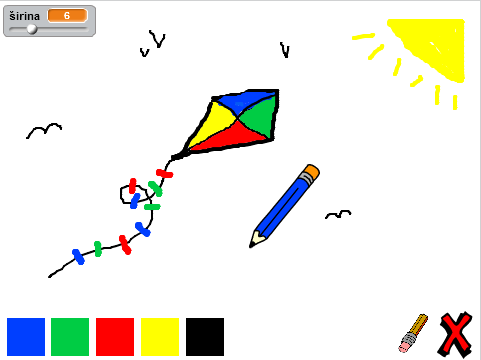

--- no-print ---

This is the **Scratch 2** version of the project. There is also a [Scratch 3 version of the project](https://projects.raspberrypi.org/me-ME/projects/paint-box).

--- /no-print ---

## Uvod

Napravi sopstveni program za crtanje!

### Šta ćeš napraviti

Klikni na zelenu zastavicu da započneš projekat. Koristi miša da pomjeraš olovku i drži pritisnut lijevi taster miša da crtaš. Klikni na boju da promijeniš olovku ili klikni na gumicu ako treba nešto da izbrišeš. Da obrišeš stranicu, klikni na krstić.

  <iframe allowtransparency="true" width="485" height="402" src="https://scratch.mit.edu/projects/embed/239832268/?autostart=false" frameborder="0"></iframe>
  

### Šta ćeš naučiti

Ovim projektom obuhvaćeni su elementi iz sljedećih dijelova [Raspberry Pi Digital Making Curriculum](http://rpf.io/curriculum){:target="_blank"}:

+ [Kombinujte programske konstrukcije za rješavanje problema.](https://www.raspberrypi.org/curriculum/programming/builder){:target="_blank"}

### Dodatne informacije za nastavnike

Ukoliko je potrebno da odštampate ovaj projekat, koristite [verziju za štampu](https://projects.raspberrypi.org/me-ME/projects/paint-box-scratch2/print){:target="_blank"}.

Koristite link koji se nalazi u podnožju stranice da pristupite GitHub repozitorijumu za ovaj projekat, koji sadrži sve izvore (uključujući primjer završenog projekta) u 'me-ME/resources' folderu.