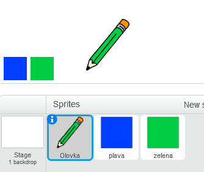

## Olovke u bojama

Dodajmo u tvoj projekat olovke različitih boja i omogućimo korisniku da izabere onu koju želi.

+ Klikni na lik olovke, zatim klikni na 'Costumes' (Kostimi) i umnoži (duplicate) kostim 'olovka-plava'.


+ Preimenuj novi kostim u 'olovka-zelena' i oboji olovku u zeleno.


[[[generic-scratch-rename-sprite]]]

+ Napravi dva nova lika - plavi kvadrat i zeleni kvadrat. Koristićeš ih da odabereš plavu ili zelenu olovku.



+ Promijeni nazive svojih likova u 'plava' i 'zelena'.

+ Dodaj kôd liku 'zelena' tako da, kada se klikne na njega, `pošalje`{:class="blockevents"} (broadcast) poruku "zelena" liku olovke, govoreći mu da promijeni svoj kostim i boju olovke.


[[[generic-scratch-broadcast-message]]]

+ Pređi na lik olovke. Dodaj kôd da ovaj lik, kada primi `poruku`{:class="blockevents"} zelena, promijeni kostim u olovka-zelena i boju kojom crta olovka u zelenu.


Da bismo postavili da olovka crta zelenom bojom, klikni na obojeno polje u bloku `set pen color`{:class="blockpen"} (postavi boju olovke), a zatim klikni na zeleni lik da izabereš istu zelenu boju kao što je boja olovke.

+ Sada možeš da uradiš isto za ikonu plave olovke. Dodaj ovaj kôd liku plavog kvadrata:

```blocks
when this sprite clicked
broadcast [plava v]
```

...i dodaj sljedeći kôd liku olovke:

```blocks
when I receive [plava v]
switch costume to [olovka-plava v]
set pen color to [#0000ff]
```

+ Na kraju, dodaj sljedeći kôd da kažeš liku olovke sa kojom bojom da započne i da ekran bude obrisan.


Izabrali smo da započnemo sa plavom, ali ako želiš, možeš da počneš i sa olovkom neke druge boje.

+ Isprobaj svoj projekat. Možeš li da zamjenjuješ plavu i zelenu olovku kada klikneš na likove plavog ili zelenog kvadrata?

