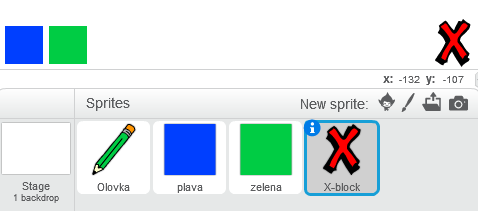
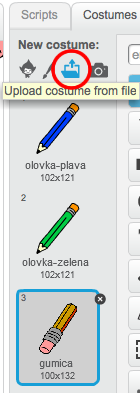
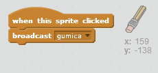
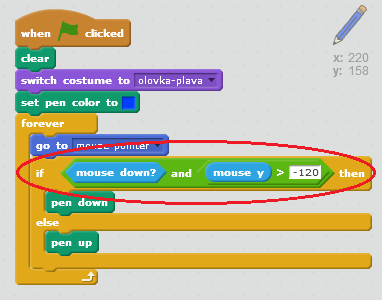

## Greške

Ponekad se dešavaju greške, pa ćemo dodati dugme 'obriši' i gumicu.

+ Dodaj lik 'X-block' - naći ćeš ga u biblioteci (library), u odjeljku 'Letters' (Slova). Oboji kostim u crveno. To će biti dugme 'obriši'.



+ Dodaj kôd ovom liku da obriše pozornicu kada se na njega klikne.


Obrati pažnju da nije potrebno da šalješ poruku za brisanje pozornice, pošto možeš da koristiš blok clear (obriši) ovog lika.

Vjerovatno primjećuješ da tvoj lik olovke ima kostim gumice:



+ Tvoj projekat takođe ima poseban lik gumice. Klikni desnim tasterom miša na njega i izaberi 'show' (prikaži). Tvoja pozornica bi trebalo da izgleda ovako:


+ Dodaj liku gumice kôd koji će olovci reći da se zamijeni sa gumicom kada se klikne na ovaj lik.



Kada olovka dobije poruku "gumica", kostim olovke možeš zamijeniti kostimom gumice, a boju olovke promijeniti u bijelu - boju jednaku boji pozornice!

+ Dodaj kôd za kreiranje gumice

--- hints --- --- hint --- Dodaj kôd liku olovke: **Kada dobijem** (when I receive) poruku **gumica** **Promijeni kostim** (switch costume) u gumica **Postavi boju olovke** (set pen color) u bijelu --- /hint --- --- hint --- Ovako bi trebalo da izgleda kôd unutar lika olovke:

```blocks
when I receive [gumica v]
switch costume to [gumica v]
set pen color to [#FFFFFF]
```

--- /hint --- --- /hints ---

+ Isprobaj svoj projekat da provjeriš da li možeš da brišeš na pozornici.


Postoji još jedan problem sa olovkom - možeš da crtaš bilo gdje na pozornici, uključujući i dio sa ikonama za izbor!


Da bismo to popravili, treba da kažeš olovci da crta samo ako se klikne mišem *i* ako je y-pozicija miša veća od -120:



+ Isprobaj svoj projekat; sada ne bi trebalo da možeš da crtaš u blizini blokova za izbor.

